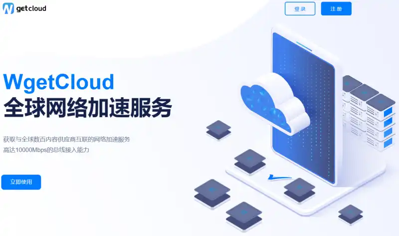
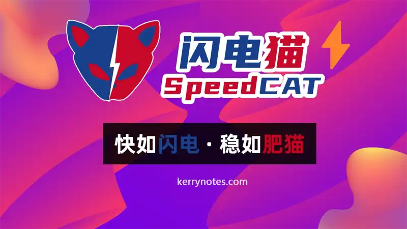
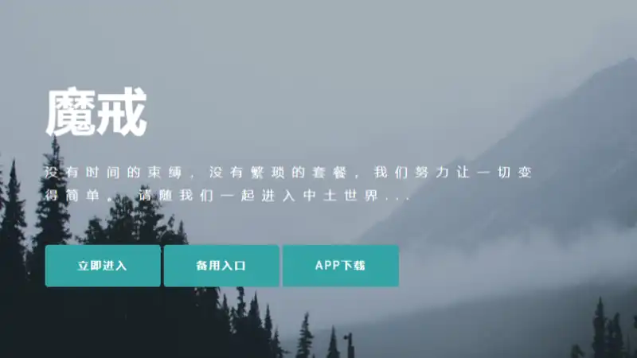

当前主流的翻墙方式当属机场服务。它不是VPN，但使用体验优于VPN，如果不是对数据隐私和安全有执念的，都推荐使用机场服务，因为机场的速度快，使用简单下面是我自己用过的几个优质高速稳定的翻墙机场推荐，排名不分先后，建议根据自身需求选择，并非越贵的套餐就越好，请理智消费。

https://kerrynotes.com/vpn-coupon-code

**写在前面** (新人建议点击展开）

1. 选机场，稳定第一，再去考虑流量和价格。付费机场的速度一般都还可以。

3. 根据自己的需求选择，如果只是轻度使用（查查资料，浏览网站，偶尔看视频），选个100GB以内的套餐应该可以。如果是经常看视频的，建议200GB往上。

5. 中转线路日常使用足够了，如果是特殊时期，那就需要IEPL/IPLC专线了。

7. 限制设备数一般是按公网（IP）计算，理论上可以和同事、室友、同学、好友共享。

9. [iOS的客户端](https://kerrynotes.com/shadowrocket-tutorial/)需要非中国区账号且要购买，如果不想折腾可以直接买一个。

11. 做外贸的，如果需要登录FB这些的，不要随意换地区节点，容易封号。

13. 刚开始别一下买太长时间，先月付或者季付，降低试错成本，更何况机场还有跑路的风险。

15. 所有机场都支持看YouTube/Tik Tok/P站/X站等；大部分机场都支持网飞Netflix/Hulu/HBO/TVB/动画疯等流媒体解锁。解锁不是给你会员，你要有对应的会员才能看剧的，没有会员的可以选择去[奈飞小镇](https://kerrynotes.com/go/nftown)合租，比较划算。

17. 要注意机场节点的倍率，2倍率就是你用1M算你2M流量，别看一个月50GB挺多，如果看视频，流量可能一下就没了。

19. 每逢节日，机场都会有优惠，购买之前可以在后台看下公告。

21. 不要迷信测速，由于大陆网络环境十分复杂，不同地区，不同运营商以及不同时间段的测试结果可能存在巨大误差，结果仅供参考。

23. 有些机场有审计：禁止BT下载，阻断某些网站的访问，不允许用户进行非法行为等。如果想追求私密性，可以自购服务器搭建机场。

## WgetCloud - 主打稳定的精品机场，￥49/月起，新用户首单8折

- 中国多ISP BGP专线加速网络，动态调整私域网络；

- 支持Netflix、Disney+等多种流媒体解锁；

- 使用2Gbps的大网络带宽，秒开YouTube 4K视频；

- 支持SS/SSR/V2Ray/Trojan协议；

- 国际Global Accelerator专线加速网络，全节点SLA保障

- 新用户**首单8折**，且赠送7天奈飞体验卡；

- 支持支付宝Alipay付款；

- 支持在线工单、TG等客户服务。

WgetCloud(原 GaCloud）是一家主打稳定翻墙的机场服务商，支持Shadowsocks,V2Ray,Trojan协议，使用国内BGP中转和亚马逊Global Accelerator专线加速国际网络。支持Windows, Mac, Linus, Android, IOS全平台。目前Wgetcloud节点遍布香港、台湾、日本、新加坡、美国等。线路不算多，但都是十分优质的低延迟BGP中转线路。WgetCloud老板在香港，在香港有自建机房，独享线路，可以保证高峰期稳定翻墙。并且通过 GaCloud 的服务，可以观看包括 Netflix、Disney+、Hulu、HBO、TVB、Happyon、AbemaTV 等在内的多种流媒体视频，聆听包括 Spotify、Pandora 等在内的流媒体音乐。

https://kerrynotes.com/wgetcloud-review

套餐价格

| 套餐 | 月付 | 季付 | 年付 | 特点 |
| --- | --- | --- | --- | --- |
| 基础专线 | ￥49/120GB/月 | ￥147，180GB/月 | ￥588，240GB/月 | 带宽200Mbps  
节点15个 |
| 优质专线 | ￥59/140GB/月 | ￥177，210GB/月 | ￥708，280GB/月 | 带宽300Mbps  
节点15个  
非高峰期带宽翻倍  
节点负载均衡 |
| 精品专线 | ￥69/160GB/月 | ￥207，240GB/月 | ￥828，320GB/月 | 带宽500Mbps  
节点29个  
非高峰期带宽翻倍  
节点负载均衡  
高可用保障 |

[访问WgetCloud](https://kerrynotes.com/go/wgetcloud)

## TaiShan Net 机场 - 性价比很高，速度不错，价格也很美丽，￥8.5起

TaiShan Net, 就叫它泰山机场吧，我23年4季度开始用的机场，第一次用这个价位的机场，一开始也只是抱着试试的心思，毕竟很便宜，￥8.5/月，￥68一年（涨价后），当时想着别人一个月，这机场能用一年。谁知道用下来的体验还不错，速度让人满意，价格也很满意。不过最近他们家的按量付费的套餐要涨价了，涨价之后，月付套餐的性价比更加凸显。

- 40+节点，涵盖美国、香港，台湾，日本，新加坡，德国，英国等地区。

- 中转线路1倍率，IPLC 8倍率。

- 不限速、不限制同时在线设备数。

- 支持ChatGPT/流媒体/Tiktok解锁。

- 支持微信、支付宝和USDT付款。

https://kerrynotes.com/taishan-net-review

套餐价格

\[affi id=10\]

[访问TaiShan 机场](https://kerrynotes.com/jc/taishanaff)

## 闪电猫 - 全IPLC专线高速机场，无倍率，无设备数限制，￥20/月起

- 全IPLC专线线路，最高2Gbps带宽。

- **没有倍率的套路，流量是多少就是多少**。

- 解锁大多数流媒体，包括Netflix，Disney+等。

- **可免费试用。有个5元的免费测试套餐，购买时填写优惠码 _free_，可以领取。**免费套餐暂无了

- 无客户端数量限制，支持全平台。可以合租。

- 香港、台湾、新加坡、日本、美国、英国、马来西亚、土耳其、阿根廷等地区节点

- 支持支付宝付款。

- **季付9折，半年付8.5折，年付8折。**

- 有TG客服，快速响应。

闪电猫⚡️SpeedCAT机场是一家2022年开业的海外SS机场。机场主是外国人，现在团队都是主业务。闪电猫提供 Shadowsocks 协议节点，全IPLC线路，闪电猫只是想弄好机场，让国内可以在国外学习、做生意。闪电猫没有花里花俏的东西，主打速度快，稳定，没倍率。

https://kerrynotes.com/speedcat-review

套餐价格

| 套餐 | 月流量 | 月付 | 季付 | 半年付 | 年付 |
| --- | --- | --- | --- | --- | --- |
| 迷你猫 | 100GB | ￥20 | ￥57 | ￥108 | ￥192 |
| 闪电猫 | 200GB | ￥40 | ￥114 | ￥216 | ￥384 |
| 霹雳猫 | 500GB | ￥100 | ￥285 | ￥540 | ￥960 |
| 雷神猫 | 1000GB | ￥200 | ￥570 | ￥1080 | ￥1920 |
| 流星猫 | 600GB/年，流量不重置 | ￥260 |  |  |  |
| 飞天猫 | 5000GB/年，流量不重置 | ￥1800 |  |  |  |

[访问闪电猫机场](https://kerrynotes.com/go/sdm)

## 魔戒 - 按流量计费，用多少算多少，不限时间，1元起

- 稳定高速，已稳定运行三年。

- 按流量计费，无到期时间。

- 不限设备数，可多人在线，多客户端登录，可与朋友合租。

- 不限速，YouTube 4K也可以流畅观看，但4K很耗流量哦。

- 60+IP节点，覆盖30+国家和地区。

- 支持Android，iOS，Windows，MacOS平台，有自研客户端。

- 支付宝、微信、USDT付款。

- 提供[共享苹果小火箭账号](https://kerrynotes.com/shadowrocket-account/)。

https://kerrynotes.com/mojie-review

套餐价格

| 流量套餐 | 价格 | 单价 |
| --- | --- | --- |
| 2GB | ￥1 | ￥0.5/GB |
| 130GB | ￥14.9 | ￥0.115/GB |
| 420GB | ￥42 | ￥0.1/GB |
| 750GB | ￥69 | ￥0.092/GB |
| 1660GB | ￥138 | ￥0.083/GB |
| 3600GB | ￥279 | ￥0.078/GB |
| 10TB | ￥688 | ￥0.067/GB |

[访问魔戒](https://kerrynotes.com/go/mj)

## 龙猫云机场 - 全专线，不限速，不限制客户端，￥15起

龙猫云有点像刚开始的闪电猫，但价格比那会还要便宜。全IPLC专线，原生IP，最高速率可达到2000Mbps。

- 一共67个节点，覆盖香港、台湾、新加坡、日本、美国、马来西亚、土耳其和阿根廷等国家和地区。

- 所有线路无倍率，无速率限制，无客户端数量限制。

- 支持Windows，macOS，Linux，Android和iOS客户端。

- 原生IP解锁流媒体。

- 解锁ChatGPT和Tiktok。

- 支持微信和支付宝付款。

https://kerrynotes.com/totorocloud-review

套餐价格

| 套餐 | 月付 | 季付 | 半年付 | 年付 | 两年付 | 三年付 | 流量 |
| --- | --- | --- | --- | --- | --- | --- | --- |
| VIP1套餐 | ￥15 | ￥41 | ￥77 | ￥144 | ￥252 | ￥324 | 100GB/月 |
| VIP2套餐 | ￥30 | ￥81 | ￥153 | ￥288 | ￥504 | ￥648 | 200GB/月 |
| VIP3套餐 | ￥60 | ￥171 | ￥324 | ￥576 | ￥1008 | ￥1296 | 400GB/月 |
| VIP4套餐 | ￥120 | ￥360 | ￥720 | ￥1440 |  |  | 1000GB/月 |
| DIY定制套餐 | ￥400 |  |  |  |  |  |  |

[访问龙猫云](https://kerrynotes.com/jc/lmy)

## 91飞机场 - 200+节点，速度快，特色有共享福利账号

04/11 更新：即日起，新购/续费/升级普通年套餐用户，发工单标题注明Midjourney ，可获取AI作图 Midjourney Pro 和 ChatGPT Plus账号。

- 稳定，支持SS/V2Ray/Trojan协议，更安全快速。

- 增加了ChatGPT的节点。

- 增加了动态家宽，解锁奈飞，ChatGPT更好用。不过动态家宽是10X倍率。其他节点也有倍率，使用的时候要格外注意。

- 全部节点IEPL/IPLC国际出口专线、全国多运营商接入、BGP中转，晚高峰4K/8K无压力，高速稳定。

- 支持全客户端，同时还自研了客户端。

- 解锁Netflix、Disney+、Premium等流媒体原生IP。

- **正式会员可以使用网飞、麻豆视频、迪士尼流媒体、小火箭、P站高级会员账号。**

- 节点丰富，包括香港、新加坡、日本、美国、台湾、欧洲等主流和冷门国家共170+节点，其中还包括土耳其/阿根廷/泰国/巴西/南非/柬埔寨/越南/土耳其/阿根廷/英国/德国/泰国/马来西亚等一些冷门国家和地区。

- 支持支付宝和加密货币付款。

- 支持TG客服，网站在线客服。

91飞机场是一家开业3年以上的机场，速度快，性价比很高，套餐种类多，可以满足用户各种需求。线路节点丰富，200+节点，涵盖了港台、欧美、东南亚、东亚、南美、南非等国家和地区。年付用户可获得一年麻豆视频、奈飞和迪士尼流媒体会员；高级套餐以上的年付会员更有神秘网站的老司机帐号。同时还支持定制各种游戏、商务、跨境电商等独享线路，可选全球任意国家和地区。

https://kerrynotes.com/91jcnet-review

月付套餐

1. 体验套餐：月付：￥13.5，限购1次，100GB/月，Netflix、Disney+等流媒体原生解锁。

3. 基本套餐：月付：￥22.8，180GB/月，可获取IOS shadowrocket共享美区账号，其余同上。

5. 普通套餐：月付：￥42.8，400GB/月，其余同上。

7. 高级套餐：月付：￥63.8，600GB/月，其余同上。

9. 超级套餐：月付：￥98.8，1000GB/月，其余同上。

年付套餐

1. 迷你套餐：年付：￥158，每月120GB流量，Netflix、Disney+等流媒体原生解锁，发工单获取IOS shadowrocket美区以及成人网站账号。

3. 基本套餐：年付：￥260，每月220GB流量，发工单获取一年奈飞、迪士尼、成人网站账号。

5. 普通套餐：年付：￥500，每月450GB流量，发工单获取一年奈飞、迪士尼、成人网站、麻豆视频账号。

7. 高级套餐：年付：￥750，每月700GB流量，发工单获取一年奈飞、迪士尼、成人网站、麻豆视频账号。

9. 超级套餐：年付：￥999，每月1300GB流量，发工单获取一年奈飞、迪士尼、成人网站、麻豆视频、P站高级账号。

流量套餐

1. 150GB流量包：￥78，无时间限制，发工单获取iOS Shadowrocket共享账号。

3. 350GB流量包：￥158。

5. 800GB流量包：￥338。

7. 2000GB流量包：￥818。

[访问91飞机场](https://kerrynotes.com/go/91jc)

## SSRDOG机场 - 稳定专线机场，新用户68折优惠，共享小火箭，游戏加速

SSRDOG机场是2022年成立的IEPL专线机场，主打的就是个在线稳定和低延迟。比较良心的是对因为敏感时期/节点维护受到影响的用户，SSRDOG**提供多条备用线路切换使用**，并视情况统一**补偿付费用户订阅使用时长**。

- 节点在线率99.99%（企业级，个人套餐会提供备用线路，所以稳定性还是有保障的）

- 稳定解锁解锁Netflix、Disney+等流媒体。全球解锁ChatGPT。

- 支持iOS, Android, macOS，Windows, Linux等客户端。且提供共享小火箭账号。

- 节点包括香港、台湾、新加坡、日本、美国、菲律宾等。

- 支持按月付费和按流量付费。不限制在线设备数。

- 客服响应快。

- 支持支付宝付款。

https://kerrynotes.com/ssrdog-review

套餐价格

| 套餐 | 价格 | 流量 | 带宽 | 是否有备用线路 |
| --- | --- | --- | --- | --- |
| 轻量套餐 | ￥25/月，￥240/年 | 150GB/月 | 300Mbps | 否 |
| 标准套餐 | ￥35/月，￥336/年 | 300GB/月 | 500Mbps | 是 |
| 企业套餐 | ￥75/月，￥720/年 | 850GB/月 | 1000Mbps | 是 |
| 500GB流量包 | ￥220 | 500GB | 1000Mbps | 是 |
| 1000GB流量包 | ￥400 | 1000GB | 1000Mbps | 是 |

[访问SSRDOG机场](https://kerrynotes.com/go/ssrdogaff)

## GLaDOS - 老牌稳定机场，年付性价比高，高校用户可以免费领1年

- 老牌机场了，稳定运营了6年了。

- 支持全平台以及路由器配置。

- 支持游戏加速（iOS/PC/Switch/PS4/PS5/XBOX）

- 年付套餐就送iOS客户端（Stash）

- Pro以上套餐支持奈飞、Hulu、HBO等流媒体解锁，但不保证长期解锁。

- 推出了一个GPTDOS OpenAI客户端。就是调用了OpenAI的API，支持上下文，支持新建聊天，支持自定义提示。可以免费试用。

- 支持支付宝、PayPal、国际信用卡付款。

- GLaDOS 提供 7 天退款到 PayPal/Visa/Mastercard 承诺, 通过 PayPal 支付的需要支付每笔 5 美元手续费, 通过 Visa或Mastercard 不需要支付手续费.（支付宝/微信不能退款）

- 给[高校用户提供一年的免费套餐](https://kerrynotes.com/gladosjc-review/#toc5)，对于有科研需求的同学和老师来说，还挺不错。对医学生提供Pro套餐。下面有领取方式。**如果你已经是付费用户，那么可以领当前的套餐。**

- 可以在线故障诊断，测速。

- 但是吧，虽然是有客服，但客服的反映速度不咋地。

https://kerrynotes.com/gladosjc-review

\[affi id=14\]

注册可以用一下邀请码：VAWNN-MJAVB-QTBUT-A4SHJ

[访问GLaDOS](/jc/glaaff)

## CyberGuard - 主打稳定的IEPL机场

CyberGuard（CG网络加速器）是IEPL专线机场，目前大多用的是深港专线和日美韩的AnyCast网络，而且线路流媒体解锁包括OpenAI类的都是全解锁的（部分还在优化）。据说团队都在海外，而且他们专线的供应商也是合伙人之一，在线路稳定性上会有保证。

- 提供按月付费和按流量付费两种套餐，尤其是按量套餐性价比还是不错的。

- 支持SS协议。不限制设备数

- 超过14+ IPLC/IEPL企业内网专线线路节点，包括不限于深港专线，热备多路由，AnyCast网络，负载均衡优化。

- 覆盖香港、日本、新加坡、韩国、美国、德国、荷兰、英国等国家和地区。

- 支持流媒体解锁和OpenAI解锁。

- 支持支付宝、微信付款。

https://kerrynotes.com/cyberguard-review

\[affi id=7\]

[访问CyberGuard机场](https://kerrynotes.com/jc/cyberaff)

## 奈云机场 - 基础套餐有性价比，￥128/年，可试用3天

奈云是一家2021年底成立的机场，提供SS和Vmess协议，中转线路1倍率，IPLC线路（3倍倍率），有原生和家宽IP，官方承诺保证奈飞等流媒体的解锁。加上超多流量，追剧达人可选了。

使用下来的感受还是不错的。4K油管视频速度在我这能跑满秒开，而且感觉流量跑得也比较慢。

奈云机场官方有定制一键翻墙VPN客户端，适用于 Windows/Mac/安卓系统，也可以使用 Clash 客户端 ，iOS 用户需要自行购买[小火箭 Shadowrocket](https://kerrynotes.com/tag/shadowrocket)。

不过客服的响应速度有点慢，我只能用基础套餐太便宜来安慰自己了(之前是98一年，现在涨到128了，如果碰上促销才感觉划算一些。

| 区域 | 国家和地区 | 流媒体解锁 |
| --- | --- | --- |
| 亚洲 | 🇭🇰 香港、🇹🇼 台湾、🇸🇬 新加坡、🇯🇵 日本 | 解锁当地 Netflix |
| 欧美 | 🇺🇸 美国 | 解锁当地 Netflix |
| 其他特殊地区 |  暂无 | 暂无 |

同时，奈云的性价比也很不错。计费分为按时间计费和按流量计费，可以根据需要自行选择。

https://kerrynotes.com/naiyunjc-review

套餐价格

| 套餐 | 月流量 | 月付 | 季付 | 半年付 | 年付 |
| --- | --- | --- | --- | --- | --- |
| Basic基础版 | 168GB | N/A | N/A | N/A | ￥128 |
| Pro进阶版 | 388GB | ￥28 | ￥80 | ￥150 | ￥280 |
| Max专业版 | 788GB | ￥49 | ￥138 | ￥268 | ￥490 |
| 流量包 | 流量 | 价格 |  |  |  |
| 238GB流量包 | 一次性流量238GB，不限时间 | ￥98 |  |  |  |
| 680GB流量包 | 一次性流量680GB，不限时间 | ￥218 |  |  |  |
| 2TB流量包 | 一次性流量2TB，不限时间 | ￥498 |  |  |  |

[访问奈云机场](https://dianwo.org/naiyun)

## Nice Cloud 机场 - 原生+家宽，共享小火箭，￥14.99起

Nice Cloud 机场是2022年的机场，30+地区网络，IEPL专线、全隧道中转加速。不记录用户日志，匿名且稳定。支持解锁流媒体，ChatGPT访问。性价比优选，折后可低至12.6元/月。

- 全套餐都提供流媒体/tiktok解锁。

- 有共享小火箭账号。

- 支持按月付费和按流量付费，价格也不贵，最便宜的14.99元90GB每月。

- 支持微信和支付宝付款

Nice Cloud机场支持按月付费和按流量付费。不同套餐对应的每个月流量、带宽、限制设备数不一样。

按流量计费的带宽要高于按月计费，还不限制设备数。甚至还有**一个永久套餐（￥999），1000GB的流量包，用完可以开工单找客服重置。**

https://kerrynotes.com/nice-cloud-review

常驻9折优惠码：iCcm6S4I

套餐价格

| 套餐 | 月流量 | 月付 | 季付 | 半年付 | 年付 |
| --- | --- | --- | --- | --- | --- |
| 轻量Lite | 90GB | ￥14.99 | ￥42.99 | ￥86.99 | ￥162.99 |
| 基础Basic | 200GB | ￥19.99 | ￥55.99 | ￥112.99 | ￥231.99 |
| 中级Big | 300GB | ￥23.99 | ￥69.99 | ￥139.99 | ￥249.99 |
| 高级Pro | 400GB | ￥34.99 | ￥99.99 | ￥189.99 | ￥349.99 |
| Super Access | 500GB | ￥43.99 | ￥119.99 | ￥263.99 | ￥469.99 |
| 流量包 | 流量 | 价格 |  |  |  |
| 100GB流量包 | 一次性100GB流量包，不限时间 | ￥45 |  |  |  |
| 200GB流量包 | 一次性200GB流量包，不限时间 | ￥65 |  |  |  |
| 500GB流量包 | 一次性500GB流量包，不限时间 | ￥150 |  |  |  |
| 1000GB流量包 | 永久1000GB，用完可找客服重置 | ￥999 |  |  |  |

[访问Nice Cloud机场](https://kerrynotes.com/go/niceaff)

## 大哥云机场 - 运营四年稳定的中转/专线机场，￥19.9起

大哥云机场，4年的老机场，老板据说是在东南亚。Vmess 和 Trojan 的中转机场，出口是湖南联通和广州移动。注册之后有6小时10GB的试用。

- 55个节点，覆盖香港、日本、台湾、韩国、新加坡、美国、英国、印度、加拿大、越南、菲律宾、泰国等国家地区。

- 有自己的客户端，需要安装.NET Framework 4.8。当然也支持其他第三方的。

- 支持解锁奈飞等流媒体以及ChatGPT，香港、台湾和英国有原生IP。

- 不限制客户端数量。

- 支持支付宝和微信支付。

https://kerrynotes.com/dageyun-review

\[affi id=8\]

[访问大哥云机场](https://kerrynotes.com/jc/dgyunaff)

## 贝雪云机场 - 香港机场，适合个人轻度使用，￥9.9起

贝雪云机场是一家成立于2021年的香港服务商，它采用Trojan协议，高速中继线路。服务器节点覆盖5+国家和地区38+服务器。他们采用了CMI、AS9929和CN2等优质专线，构建了高端的加密网络链路，并建立了自己的机房来提供原生IP。全年24小时监控和维护线路，确保流量稳定、安全、高速。同时还不断更新渗透技术以提高线路质量，利用新技术和企业专线，让用户享受如丝般顺滑的加速体验。

- 香港团队，稳定运行两年。

- 高速线路，1Gbps带宽（低档套餐达不到这个速率），支持YouTube 4K。

- 节点覆盖香港、东京、新加坡、圣何塞、德国法兰克福、伦敦等。

- 解锁Netflix、Disney+等流媒体。

- TLS多重加密，安全可靠，不记录日志。

- 免费试用，注册送3天9GB。

- 支持全平台。

- 支持支付宝、微信、信用卡、USDT支付。

**注意：节点是有倍率的，也就是说120GB，按照2倍算，也就是只有60GB，但胜在便宜**，相比其他机场可能还是有一点点价格优势。

https://kerrynotes.com/besnowcloud-review

套餐价格

<table><tbody><tr><td>套餐</td><td>包月</td><td>包年</td><td>月流量</td><td>同时在线设备数</td></tr><tr><td>Lite 轻量</td><td>￥9.9</td><td>￥99</td><td>120GB</td><td>3</td></tr><tr><td>Premium 优质</td><td>￥19.8</td><td>￥198</td><td>320GB</td><td>3</td></tr><tr><td>Pro 专业</td><td>￥29.7</td><td>￥297</td><td>640GB</td><td>6</td></tr><tr><td>Ultra 极致</td><td>￥49.8</td><td>￥498</td><td>1TB</td><td>9</td></tr><tr><td>Customized 定制</td><td>￥999</td><td></td><td>3TB</td><td>独享IP，多设备在线，自媒体，外贸，独立站，Shopify等</td></tr></tbody></table>

[访问贝雪云机场](/go/besnow)

## 我该用什么客户端？

基本上现在的机场都是用的第三方客户端，也有些机场是有自己的客户端的，但大多也是基于开源的客户端改的。机场能用哪个你就用哪个，你更熟悉哪个就用哪个。

虽然说[Clash 删库了](https://kerrynotes.com/alternatives-to-clash/)，但现在仍然是最流行的客户端了。

- Windows：[Clash for Windows](https://kerrynotes.com/clash-for-windows-tutorial/)，[Clash Verge](https://kerrynotes.com/clash-verge-tutorial/)，[V2rayN](https://kerrynotes.com/v2rayn-for-windows-tutorial/)，[ClashN](https://kerrynotes.com/clashn-tutorial/)，[Hiddify](https://kerrynotes.com/hiddify-quick-start/)

- macOS：[Clash X](https://kerrynotes.com/clashx-tutorial/)，[Hiddify](https://kerrynotes.com/hiddify-quick-start/)。

- iPhone：[ShadowRocket](https://kerrynotes.com/shadowrocket-tutorial/)。俗称小火箭，售价2.99美元，需要有[海外的Apple ID](https://kerrynotes.com/register-american-apple-id/)。Clash的iOS版本：Stash 也是不错的选择，售价同样是2.99美元。现在出了个[sing-box](https://kerrynotes.com/sing-box-tutorial/)，免费的，也能用。

- Android：[Clash for Android](https://kerrynotes.com/clash-for-android-tutorial/)，[Surfboard](https://kerrynotes.com/surfboard-tutorial/)，[sing-box](https://kerrynotes.com/sing-box-tutorial/)，[Hiddify](https://kerrynotes.com/hiddify-quick-start/)，[Clash Meta for Android](https://kerrynotes.com/clash-meta-for-android-tutorial/).

## 其他推荐

https://kerrynotes.com/cost-effective-ss-proxy

https://kerrynotes.com/best-vpn-pay-by-traffic

## 折叠内容

如果我自己最近体验不好，我会把它放到折叠内容里:

- 2024-9-1：DuangCloud服务器到期了，订阅无法使用，官网不能访问，群里两拨人在抢客户，大概确实是[跑路](https://kerrynotes.com/did-duangcloud-run-away/)了。

- 2024-8-29：DuangCloud 持续一段时间不能访问了，但订阅还能用。TG群里说老板被抓了，先折叠了。

- 2024-7-13：折叠了管人痴，感觉它最近节点全红的次数有点多。好像不如之前稳定，先观察观察。

管人痴机场 - 自用5年的机场，稳定快速，套餐内流量当月用不完不重置

我自己18年开始使用的机场，现在是跟同事们一起用。节点多，速度快，流量也够用，遇到敏感时期也没有影响，出了问题修得也算及时，总之还是挺满意的，不然不至于一直续费。记得那会才￥100一年，现在年套餐已经是￥240了。

跟我用过的其他机场最大不同是套餐的流量计算方式不一样，别的机场都是按月重置流量，但管人痴的套餐流量是不重置的，套餐里有多少流量就能用多少。我买的是￥240/2500GB/年，每年都没用完过，工作的时候看视频少，我一年用下来还不到300GB。

- 200+节点，覆盖加拿大、美国、俄罗斯、韩国、日本、香港、台湾、印度、澳大利亚、爱尔兰、英国、德国、新加坡、法国等国家和地区。

- 无倍率，无速率限制。

- 无客户端数量限制，但仅限本人使用。（其实我跟别人分享也没事）

- 提供商业计划，不限人数，不限客户端，不限流量，可开增值税发票。

- 文档比较全，支持客户端也全。

- 支持流媒体、ChatGPT解锁。

- 支持支付宝付款。

https://kerrynotes.com/guanrenchi-review

套餐价格

<table><tbody><tr><td>套餐</td><td>月付</td><td>季付</td><td>年付</td><td>2年付</td></tr><tr><td>个人标准版</td><td>￥24.99/204.8GB</td><td>￥69.99/768GB</td><td>￥239.99/2500GB</td><td></td></tr><tr><td>个人小流量</td><td>￥14.99/16GB</td><td></td><td>￥180/200GB</td><td>￥350/400GB</td></tr><tr><td>个人增强版</td><td>￥34.99/307.2GB</td><td></td><td>￥349.99/3584GB</td><td></td></tr><tr><td>个人行业版</td><td>￥49.99/512GB</td><td></td><td>￥449.99/4500GB</td><td></td></tr><tr><td>家庭标准版</td><td>￥149.99/1500GB</td><td></td><td>￥599.99/9000GB</td><td></td></tr><tr><td>小微企业标准版</td><td></td><td></td><td>￥3499.99/35000GB</td><td></td></tr><tr><td>定制1Gbps独享专线</td><td>￥249999/660000GB</td><td></td><td></td><td></td></tr></tbody></table>

[访问管人痴机场](https://kerrynotes.com/jc/grcaff)

（疑似跑路）DuangCloud - 小众稳定机场，内网专线不过墙

- 专业的老牌优质SS机场。

- 企业级华为BGP专线中转/IEPL内网专线，内网专线不过GFW，不存在被封锁的可能。

- 节点覆盖香港、台湾、日本、美国、新加坡、韩国等地区。

- 美国原生IP，玩ChatGPT还不错。

- 万兆专线不限速，满足大部分用户的需求。

- 有支持Windows/MacOS/Android平台的傻瓜式一键登录客户端。

- 支持奈飞、TVB、AbemaTV等流媒体解锁。

- **全部套餐无设备数量限制，合租性价比超高。**

- 支持支付宝、微信、虚拟货币付款。

- 支持工单和网站在线支持。

https://kerrynotes.com/duangcloud-review

**套餐价格**

1. Mini：月付￥20，每月50GB流量，季付￥60，半年付￥120，年付￥200；

3. Basic：月付￥35，每月150GB流量，季付￥105，半年付￥210，年付￥350；

5. Pro：月付￥55，每月300GB流量，季付￥165，半年付￥330，年付￥550；

7. Gold：月付￥75，每月500GB流量，季付￥225，半年付￥450，年付￥750；

9. Diamond：月付￥100，每月800GB流量，季付￥300，半年付￥600，年付￥1000。
