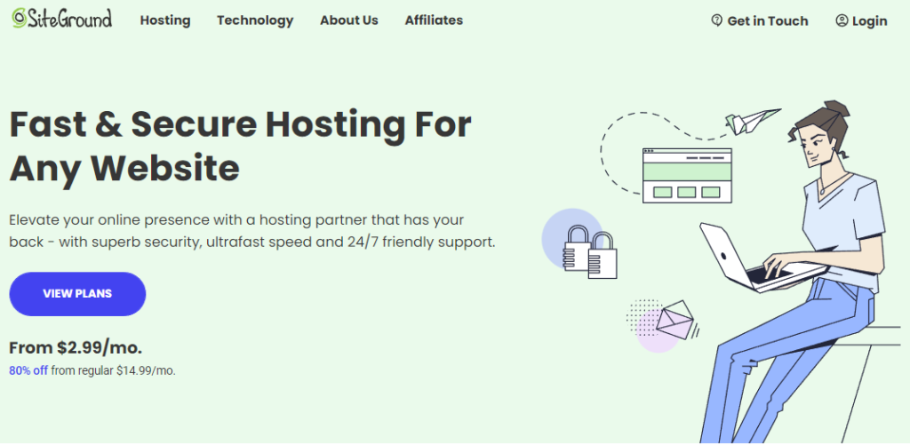
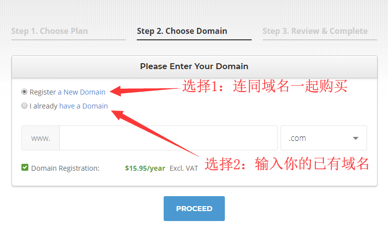
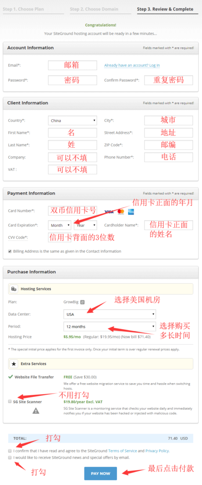
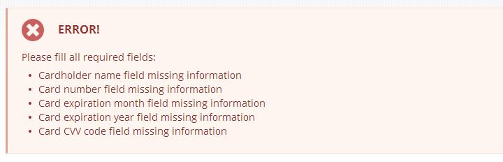

[SiteGround](https://www.siteground.com/go/ic9bxzlppy) 是 WordPress 官方推荐的网站主机。价格便宜，功能强大，非常适合外贸新手搭建外贸独立站和跨境独立站，接下来我就详细介绍一下它的购买方法及步骤。

**购买前有两点需要注意：**SiteGround 不提供优惠码优惠券，但新用户首次购买有 70% 的折扣。除此之外，购买时最好不要使用外网工具，否则会因为 IP 地址不同变成欺诈订单，导致购买失败。

## 打开 SiteGround 官网

SiteGround 官网：[www.siteground.com](https://www.siteground.com/go/ic9bxzlppy)，如果打不开或者像下图一样显示不全，是因为你电脑宽带的 DNS 解析不了 SiteGround，解决方法是把电脑本地 DNS 地址替换成谷歌的 DNS 解析地址：8.8.8.8 和8.8.4.4。

然后清除 DNS 缓存，再刷新页面就能正常访问 SiteGround 了：

- 如果你是外贸 B2B 建站，可以直接购买 [WordPress主机](https://www.siteground.com/go/khwh5gsuz6)

- 如果你是外贸B2C建站，可以直接购买 [WooCommerce主机](https://www.siteground.com/go/tz2fvowtou)

WordPress 主机和 WooCommerce 主机，实际是一个东西，没有任何区别。官方之所以这样做，只是为了告诉大家 SiteGround 不仅支持 WordPress 建站，也支持 WooCommerce 建站。

## 选择套餐方案

SiteGround 一共有三个套餐方案 StartUp、GrowBig、GoGeek，如下图所示。

三个套餐方案的主要区别如下，具体可以看 SiteGround 套餐官方对比说明。

- StartUp：3.95 美元/月、只能托管一个网站

- GrowBig：5.95 美元/月、托管网站不限、速度更快、1.5 倍服务器资源

- GoGeek：11.95 美元/月、托管网站不限、速度更快、4 倍服务器资源、半专用主机

如果让我建议，我选择 GrowBig 方案，点击 GET PLAN 按钮会看到下图。

- 方案1：连同域名一起购买，好处是不用域名解析，但域名费用高

- 方案2：输入你的已有域名，需要去单独购买域名，好处是价格低，但要做域名解析

如果让我建议，我选方案 2，去 namesilo、namecheap、阿里云等专门注册域名的地方单独购买域名，然后选 I already have a domain，把买好的域名填到空白处点 PROCEED。

## 填写账号密码和个人信息，最后付款

接下来用英文或拼音，填写邮箱密码、个人信息、填个大概就行，然后使用双币信用卡付款。

- 机房，如果你是外贸建站选**美国 USA**，如果你是国内建站，选择香港台湾或者新加坡

- 购买时间推荐 2~3 年，主要考虑到续费会恢复原价，很多人可能网站才有起色就面临续费

SiteGround 除了支持双币信用卡付款，**还可以 Paypal 付款。**

Paypal 购买 SiteGround 方法如下：

1. 首先访问 [SiteGround](https://www.siteground.com/go/ic9bxzlppy)，和上面的步骤一样，正常添加域名，填写信息

3. 信用卡那一栏空着不填，剩下的填完直接提交，提交后会有一个报错，如下图所示

5. 最后联系 SiteGround 客服，和他们说你要 Paypal 付款，他们会发你 Paypal 付款链接

## 总结

至此，SiteGround 注册购买，如何选择套餐和机房，以及 Paypal 付款就介绍完了.

**最后说下购买期间的常见问题：**

如果提示 An account or pending order under that domain already exists in our system，解决方法是不要开外网工具，按照本教程再操作一遍，或联系客服。

如果购买不成功退款，提示 Your Verification was Unsuccessful，可以随便填个已经被注册的域名，按照上面的教程再操作一遍，购买成功后去后台可以做域名替换。

如果你购买的是 StartUp，可以在一个月之内补差价升级到 GrowBig 或 GoGeek。

如果购买完发现机房选错，可以联系 SiteGround 客服免费更换，但前提是你没有在主机上安装任何程序或上传任何文件，否则要付 30 美元才能更换，切记！

如果遇到要验证信用卡金额，按照提示操作即可，不会的话可以联系客服。

如果遇到购买出错，需要提交短信验证码，而验证码又收不到，可以选择语音接收。
