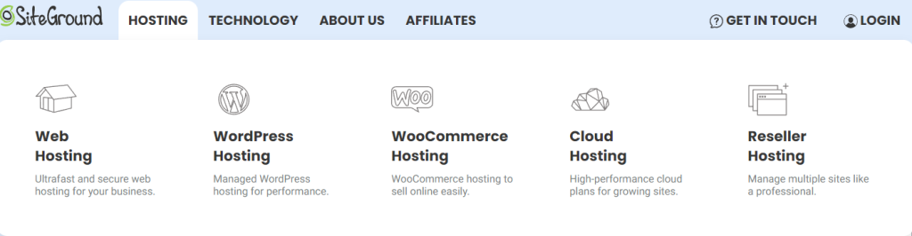

SiteGround是世界上最受欢迎的托管公司之一，为超过 280 万个不同的域提供服务。这家公司成立于 2004 年，自那时以来一直在不断努力发展和改进。如今，SiteGround 为数百万客户提供服务，拥有 500 多名员工，并在全球运营多个数据中心。通过始终提供最高质量的托管服务，使这一成功水平成为可能。

很明显，SiteGround 致力于以合理的价格为其客户提供最好的托管服务。虽然它绝对不是最便宜的托管服务提供商，但您会得到一笔非常划算的交易，WordPress 托管套餐的起价仅为每月 3.99 美元。所有托管包都包含强大的功能，例如访问免费内容交付网络(CDN)、免费电子邮件服务、开箱即用缓存、无限数据库和 Secure SHell (SSH) 证书，以确保您的网站随时可用为游客。

毫无疑问，SiteGround 的重点是其托管，但您还将获得各种其他特权以确保获得积极的体验。如果您选择使用 SiteGround 托管，请确保利用以下值得注意的选项：

- WordPress优化培训

- 营销指南

- 域名注册

- 关于如何开始在线销售的提示

- 与 Git 的简单集成（Git 是一个非常受软件开发人员欢迎的版本控制系统。它允许多人同时无缝地处理同一个代码库。）

- 数据备份和恢复解决方案

- 安全服务

## 是什么让 SiteGround 脱颖而出？

有数千家不同的网络托管公司可供选择，那么 SiteGround 真正与众不同的是什么？

### **SiteGround 不是折扣托管服务提供商**

您会注意到的第一件事是 SiteGround 并没有声称提供最便宜的托管服务。与许多专注于折扣托管选项的托管公司不同，无论您选择哪种类型的托管， SiteGround 都将速度和整体质量放在首位。

虽然大多数小型企业都希望从其共享或 WordPress 网络托管服务之一开始，但很高兴知道您始终可以升级到更强大的云托管解决方案。

### **SiteGround 适合小型企业**

无论您是为社区服务的本地企业，还是在更大区域拥有客户，您都需要一家满足您需求的托管公司。SiteGround 是小型企业的绝佳选择，因为它非常了解您的需求。

这始于强大且极其稳定的网络托管平台，并继续提供卓越的客户服务和支持。虽然这家公司并不声称自己是最便宜的托管公司，但它确实以非常合理的价格提供所有服务。

#### **专注于质量**

有很多关于 SiteGround 如何将质量托管置于折扣价或其他任何东西上的例子。了解公司如何确保您获得最佳服务水平将帮助您确定它是否是适合您的托管服务提供商。

这些只是 SiteGround 将质量放在首位的一些方式：

- 退款保证 – 所有托管套餐均提供完整的 30 天退款保证，以确保您对所提供的服务 100% 满意。

- 绿色基础设施——SiteGround 使用碳中和数据中心运营，甚至将其客户服务器使用的电力与可再生能源发电相匹配。

- 免费 CDN – 所有客户都可以免费访问全球 CDN，以确保其网站尽快加载。

## **SiteGround****的优缺点是****什么？**

SiteGround 为全球个人和中小型企业提供一些最快和最值得信赖的托管服务。但是，我们注意到一些事情可能表明该托管公司不适合您。SiteGround 不提供专用服务器，当您按月付款时价格会上涨，并且您会收到与多少磁盘空间相关的一些有限问题。

### 优点

1. **极其稳定：** SiteGround 始终将可靠性放在首位。测试证实服务器的涨幅远远超过 99.9%，这是大多数托管公司所保证的。这是由于优质服务器、冗余电源和数据电路等等。

3. **18 年以上的经验：** SiteGround 已经开展业务超过 18 年，并赢得了非凡的声誉。该公司在其服务器上运行着超过 280 万个域，非常值得信赖。

5. **非常适合 WordPress 托管：**如果您是数百万使用 WordPress 构建网站的企业之一，您一定会喜欢 SiteGround。您可以一键安装 WordPress（免费）并使用专门为此类站点配置的托管包，使其运行更快、更可靠。

7. **为小型企业提供高级支持：** SiteGround 为所有客户（包括小型企业）提供出色的支持。公司 24/7 全天候配备工作人员，并且真正了解商业网站需要立即关注，因为它会直接影响您的底线。

9. **易于使用的管理界面和功能：** SiteGround 在设计其托管界面的“后端”方面做得非常出色。管理面板在一个方便的地方提供了您通常需要的所有不同选项。您无需任何经验即可在几分钟内设置自定义备份计划，或者只需单击几下即可安装 WordPress 或其他应用程序。

11. **所有托管包中都包含 CDN：** CDN 极大地提高了网站的加载时间。这项技术的工作原理是将较大的文件（如图片、视频等）从网站分发到托管在世界各地数据中心的大量服务器上。当访问者访问您的站点时，会从最近的可能位置加载较大的文件。SiteGround 为其所有网络托管客户提供可靠的 CDN 服务，无论他们使用什么包。这使您的网站更具响应性，因此访问者会很乐意留下来。在其他托管公司，此功能通常不可用或需要额外费用。

### 缺点

1. **没有专用服务器或虚拟专用服务器 (VPS)：**虽然 SiteGround 有许多出色的托管选项，但它不提供任何专用服务器甚至 VPS。如果您的网站获得大量流量，您将无法升级到这些更高端的选项。该提供商确实有一些出色的基于云的托管选项，可以处理大量流量。. 绝大多数小型企业、企业家、个人和其他人永远不需要 VPS 或专用服务器，因此在大多数情况下这不会是一个大障碍。

3. **某些软件包的磁盘空间有限：**另一个相当小的问题是 SiteGround 的一些托管软件包没有为所有类型的站点提供足够的磁盘空间。入门级托管包仅提供 10 GB 的空间，对于大多数网站来说已经足够了。但如果您正在运行电子商务页面并加载大量产品图片或视频，则可能不会。越来越多的托管公司提供无限的磁盘空间，因此很高兴看到 SiteGround 朝着这个方向发展。但是，这只会成为少数用户的问题。

5. **每月价格有点高：**虽然价格绝对合理，但与许多其他公司相比，即使是入门级托管，您也要多付几美元。SiteGround 从未声称自己是一家折扣托管公司，而且在大多数情况下，额外的费用是值得的。话虽如此，如果您严格寻找尽可能低的成本，SiteGround 可能不是最佳选择。

## 谁应该选择SiteGround？

- **小企业：**如果您是小企业主，您的网站需要始终正常运行。SiteGround 不仅提供极其可靠的托管服务，而且还非常易于管理。您无需成为技术专家或聘请技术专家即可让您的网站正常运行。

- **企业家：**企业家需要为他们开始的任何业务或项目建立网站。许多企业家一次需要多个网站来处理不同的事情。无论您拥有何种技术经验，SiteGround 都可以让您快速轻松地启动和管理网站。

- **电子商务网站：**电子商务网站在虚拟主机中需要的最重要的事情之一是良好的 CDN，以确保无论访问者来自何处，网站都能快速加载。SiteGround 提供所有托管包的 CDN 服务。我们测试了从 CDN 加载的图像和其他文件的响应时间，一切都非常好。

- **个人制作 WordPress 博客：**如果您想创建自己的个人博客或其他网站项目，SiteGround 是一个很好的选择。我们发现我们可以在 SiteGround 注册一个帐户，安装 WordPress，并在一小时内开始发布我们的网站，因为一切都非常简单。即使您从不希望通过您的网站出名，这也是值得考虑的托管公司。但是，如果您的预算很少，这并不是最便宜的路线，尽管入门级托管仍然每月只需 2.99 美元。

- **社交网站红人：**虽然今天的影响者大部分时间都花在 TikTok 和 Instagram 等社交媒体网站上，但您通常需要一个网站来帮助与所有平台上的用户共享信息。SiteGround 是一个理想的选择，因为它易于使用，并且您可以快速链接所有社交帐户以直接发布到您的网站。

**SiteGround可能是最好的网络主机：**大多数人拥有任何类型的网站。唯一真正无法使用它的人是那些需要最高端托管选项且需要专用服务器的人。

## SiteGround 托管计划和定价

SiteGround 提供五种托管计划类型：

- 共享主机（每月 2.99 美元 – 7.99 美元）

- WordPress 托管（每月 2.99 美元 – 7.99 美元）

- WooCommerce 托管（每月 2.99 美元 – 7.99 美元）

- 云托管（每月 100 - 400 美元）

- 经销商托管（每月 4.99 美元 – 100 美元）

这些托管类别中的每一个都将有三个或更多特定的包可供选择。最便宜的选择是每月 2.99 美元，最贵的是每月 400 美元。您还可以根据您的特定要求选择自定义配置的托管包。

### SiteGround 共享主机包

<table><tbody><tr><td></td><td><strong>StartUp</strong></td><td><strong>GrowBig</strong></td><td><strong>GoGeek</strong></td></tr><tr><td><strong>价格：</strong></td><td>2.99 美元/月</td><td>4.99 美元/月</td><td>7.99 美元/月</td></tr><tr><td><strong>最适合：</strong></td><td>个人网站当地小型企业低流量页面</td><td>区域小企业社交媒体影响者运行多个网站的任何人</td><td>电子商务网站小型在线企业老牌企业家</td></tr><tr><td><strong>网站：</strong></td><td>1</td><td>无限</td><td>无限</td></tr><tr><td><strong>磁盘空间：</strong></td><td>10GB</td><td>20GB</td><td>40 GB</td></tr><tr><td><strong>带宽：</strong></td><td>无限</td><td>无限</td><td>无限</td></tr><tr><td><strong>电子邮件帐户：</strong></td><td>无限</td><td>无限</td><td>无限</td></tr><tr><td><strong>电子邮件存储：</strong></td><td>无限制（最多磁盘空间限制）</td><td>无限制（最多磁盘空间限制）</td><td>无限制（最多磁盘空间限制）</td></tr><tr><td><strong>附加功能：</strong></td><td>免费 SSL 证书免费CDN</td><td>免费 SSL 证书免费CDN按需备份副本</td><td>免费 SSL 证书免费CDN按需备份副本免费私人域名服务 (DNS)优先支持超文本预处理器 (PHP) 速度提高 30%</td></tr></tbody></table>

**谁应该使用共享主机？**今天最流行的类型，共享主机非常适合任何想要以非常实惠的价格提供高质量主机的人。我们建议任何不确定从共享主机开始需要什么类型的人。一般来说，所有小型企业、入门级电子商务网站、个人网页，甚至许多中型公司都可以在共享主机上完美运行。

<figure>

<figcaption>

资料来源：SiteGround.com

</figcaption>

</figure>

### SiteGround WordPress 托管包选项

<table><tbody><tr><td></td><td><strong>StartUp</strong></td><td><strong><strong>GrowBig</strong></strong></td><td><strong>GoGeek</strong></td></tr><tr><td><strong>价格：</strong></td><td>2.99 美元/月</td><td>4.99 美元/月</td><td>7.99 美元/月</td></tr><tr><td><strong>最适合：</strong></td><td>小型企业、个人、博主</td><td>区域企业、在线企业、企业家</td><td>国企、人气网红、知名博主</td></tr><tr><td><strong>网站：</strong></td><td>1</td><td>无限</td><td>无限</td></tr><tr><td><strong>贮存：</strong></td><td>10GB</td><td>20GB</td><td>40 GB</td></tr><tr><td><strong>附加功能：</strong></td><td>免费CDN免费电子邮件托管无限的数据库</td><td>免费CDN免费电子邮件托管无限的数据库暂存环境按需备份副本</td><td>免费CDN免费电子邮件托管无限的数据库暂存环境按需备份副本高级支持免费的私有 DNS</td></tr></tbody></table>

**谁应该使用 WordPress 托管？**如果您打算将 WordPress 用于您的网站，这是显而易见的选择。这与 SiteGround 提供的基本共享托管服务相同，但服务器是专门为 WordPress 站点配置的。要查看每个 WordPress 主机最适合哪些类型的网站，请查看上面共享主机的大纲。只要运行 WordPress 平台，相同类型的网站就会从这种托管中受益。

### **SiteGround WooCommerce 托管包选项**

<table><tbody><tr><td></td><td><strong>StartUp</strong></td><td><strong>GrowBig</strong></td><td><strong>GoGeek</strong></td></tr><tr><td><strong>价格：</strong></td><td>2.99 美元/月</td><td>4.99 美元/月</td><td>7.99 美元/月</td></tr><tr><td><strong>最适合：</strong></td><td>小型企业和电子商务网站</td><td>中型企业和电子商务网站</td><td>大型企业和电子商务网站</td></tr><tr><td><strong>贮存：</strong></td><td>10GB</td><td>20GB</td><td>40 GB</td></tr><tr><td><strong>带宽：</strong></td><td>无限</td><td>无限</td><td>无限</td></tr></tbody></table>

**谁应该使用 WooCommerce 托管？**WooCommerce 是与前两个选项相同类型的共享主机。但它是专门为使用为电子商务网站设计的 WooCommerce 平台而设置的，因此设置和运行您的在线商店非常容易。

### **SiteGround 云托管包选项**

<table><tbody><tr><td></td><td><strong>Jump Start</strong></td><td><strong>Business</strong></td><td><strong>Business Plus</strong></td><td><strong>Super Power</strong></td></tr><tr><td><strong>价格：</strong></td><td>100 美元/月</td><td>200 美元/月</td><td>300 美元/月</td><td>400 美元/月</td></tr><tr><td><strong>最适合：</strong></td><td>中型企业成功的企业家受欢迎的影响者</td><td>流量大的网站国家或全球站点资源密集型网站</td><td>具有交互式页面的网站全球电子商务网站有大量视频和图像的网站</td><td>额外繁忙的网站依赖视频或实时聊天的网站有大文件的网站</td></tr><tr><td><strong>中央处理器：</strong></td><td>4 个 CPU 核心</td><td>8 个 CPU 核心</td><td>12个CPU核心</td><td>16 个 CPU 核心</td></tr><tr><td><strong>内存：</strong></td><td>8 GBRAM</td><td>12 GBRAM</td><td>16 GBRAM</td><td>20 GBRAM</td></tr><tr><td><strong>固态硬盘存储：</strong></td><td>40 GB</td><td>80 GB</td><td>120 GB</td><td>160 GB</td></tr><tr><td><strong>网络带宽：</strong></td><td>5 TB</td><td>5TB</td><td>5TB</td><td>5TB</td></tr><tr><td><strong>专用IP：</strong></td><td>是的</td><td>是的</td><td>是的</td><td>是的</td></tr></tbody></table>

**谁应该使用云托管？**SiteGround 为其客户提供优质的云托管服务，但并不便宜。获得大量流量或资源密集型流量的站点可能希望使用云解决方案。此外，资源需求季节性起伏的站点可以从云托管中受益，因为它能够根据需求几乎立即升级和降级系统资源。成功的企业、全球电子商务公司和其他类似的大型网站都可以从这个选项中受益。

## SiteGround 托管计划功能

### **自动 WordPress 安装和更新**

SiteGround 将为您提供自动安装 WordPress 并保持更新所需的工具。此功能在其所有软件包中都可用，但大多数使用 WordPress 的人都希望使用其特定于 WordPress 的托管软件包。

### **免费电子邮件托管**

SiteGround 从其他托管公司中脱颖而出的最大方式之一是它为所有软件包提供了出色的电子邮件托管。通过这家托管公司快速轻松地设置和运行您自己的电子邮件。

**特定于域的电子邮件地址**

对于许多网站所有者，尤其是企业来说，电子邮件托管是一项重要功能。此功能允许您创建以您的域名结尾的电子邮件地址，让您看起来更专业。许多托管公司对此功能收费，但 SiteGround 不收费。

您可以根据需要创建任意数量的电子邮件帐户，无需任何额外费用。这一切都是通过您的 cPanel 完成的。此外，您可以快速轻松地设置垃圾邮件过滤器、电子邮件转发器和其他相关功能。

<figure>

<figcaption>

资料来源：SiteGround.com

</figcaption>

</figure>

### **开箱即用的缓存**

SiteGround 为其所有托管帐户提供简单的缓存解决方案。缓存可帮助过去访问过该网站的人更快地加载网站。经常访问您的网站非常重要，因此这可能是一个有用的功能。

### **30天退款保证**

SiteGround 希望确保其所有客户都满意，因此它允许您试用这些服务整整 30 天。如果您不喜欢您的体验，您可以获得全额退款。

### **每日备份**

SiteGround 的所有托管软件包都可以启用每日备份。请注意，如果每天不适合您，您可以设置自己的自定义备份计划。

<figure>

<figcaption>

资料来源：SiteGround.com

</figcaption>

</figure>

### **易于使用，定制的 cPanel**

SiteGround 已经定制了它的 cPanel 版本，使其更易于使用。该公司确保您所有最常访问的工具都可以在页面顶部找到，以便您可以在需要时访问它们。这是一个非常直观的设置，使网站的运行比以往任何时候都简单。

**SiteGround 控制面板有什么用？**

控制面板是您处理与网站托管和帐户相关的所有事情的地方，包括域名管理（托管、注册、续订或转移）、电子邮件地址/收件箱配置以及您收到的服务的付款/计费。您还可以在这里配置备份计划、监控磁盘空间使用情况，甚至安装 WordPress 等应用程序。简而言之，这是您所有站点的后端管理界面。

### **易于管理您的服务**

您可以通过一个 SiteGround 登录来管理您的整个站点，但它是您只为服务器处理所有内容的地方。如果您安装了 WordPress 之类的内容管理系统，则可以为这方面创建单独的登录名。但是，创建和管理您的网站、电子邮件和其他相关服务，都是从您的 cPanel 页面完成的。

### **使用数十种网站工具和附加组件发展您的业务**

SiteGround 包含多种工具和功能，可让您更轻松地创建和运行您的网站。无论您是经验丰富的网站管理员，还是尝试创建您的第一个网站，这些工具都将帮助您入门。

### **创建网站的多种选择**

无论您注册哪个托管包，您都可以从各种不同的内容管理系统中进行选择，包括 WordPress。如果您使用 WordPress，您可能会[从 SiteGround 中选择一个特定于 WordPress 的选项](https://digital.com/go/siteground-wordpress-3/)。即使您是自定义编码自己的网站，您也可以通过安全的 FTP 选项或内置的文件管理器工具上传这些文件。

SiteGround 市场中可用应用程序的示例。

### **99.9% 正常运行时间保证**

SiteGround 提供 99.9% 的正常运行时间保证，与行业平均水平相当。然而，根据我们使用该系统和运行测试的经验，它实际上远不止于此。它拥有业内最可靠的托管环境之一。

### **支持快速页面加载时间的技术**

SiteGround 知道网站加载速度对其客户来说是最重要的事情之一，因此这始终是优先事项。选择 SiteGround 的客户将获得固态硬盘、CDN 和其他有助于优化站点速度的优秀技术。它甚至还专门为 WordPress、WooCommerce 和其他流行类型的网站配置了托管服务器，以获得最佳性能。

**免费的 Google CDN 集成以加速您的网站**

SiteGround 已与 Google 合作开发 CDN 和各种其他功能。随着谷歌扩展其云服务，SiteGround 将利用它为客户服务。Google 在全球拥有数据中心，因此无论您网站的访问者来自哪里，他们都将获得这个优质 CDN 带来的速度提升。

### **99.9% 正常运行时间保证**

[SiteGround 提供 99.9% 的正常运行时间保证](https://digital.com/go/siteground-review/)，与行业平均水平相当。然而，根据我们使用该系统和运行测试的经验，它实际上远不止于此。它拥有业内最可靠的托管环境之一。

### **支持快速页面加载时间的技术**

SiteGround 知道网站加载速度对其客户来说是最重要的事情之一，因此这始终是优先事项。选择 SiteGround 的客户将获得固态硬盘、CDN 和其他有助于优化站点速度的优秀技术。它甚至还专门为 WordPress、WooCommerce 和其他流行类型的网站配置了托管服务器，以获得最佳性能。

**免费的 Google CDN 集成以加速您的网站**

SiteGround 已与 Google 合作开发 CDN 和各种其他功能。随着谷歌扩展其云服务，SiteGround 将利用它为客户服务。Google 在全球拥有数据中心，因此无论您网站的访问者来自哪里，他们都将获得这个优质 CDN 带来的速度提升。

### **高级安全选项**

SiteGround 超越了安全功能。一个专门的安全团队一直在寻找提高服务器安全性的方法，以及它托管的每个站点。一些有助于保护您的网站的强大功能和工具包括：

- 智能防火墙配置

- 人工智能驱动的反机器人过滤

- 24/7 主动服务器监控

- 分布式备份

- 高级 WordPress 安全功能

- 免费 SSL 证书

**免费 SSL 证书**

无论您在 SiteGround 注册哪个托管包，您都将获得 SSL 证书。这些证书来自 Let's Encrypt SSL，共享证书的领导者。拥有此证书不仅有助于保护您的网站，还有助于提高您在搜索引擎中的排名。

## SiteGround 性能和正常运行时间

### 正常运行时间和可靠性

<figure>

<figcaption>

资料来源：hrank.com

</figcaption>

</figure>

根据Hrank的测试，SiteGround 服务器在过去 30 天内的平均正常运行时间为 99.989%，令人印象深刻。

### **站点响应时间**

许多事情会影响网站的响应时间，而网站的实际制作方式是最重要的因素之一。但是，Web 主机的服务器和整体配置也会产生很大影响。SiteGround 在确保其服务器尽快响应每个请求方面做得非常出色。

<figure>

<figcaption>

资料来源：hrank.com

</figcaption>

</figure>

当我在 SiteGround 上运行测试时，平均响应时间为 622 毫秒，这非常令人印象深刻。不过，这只是衡量服务器响应请求的速度，因此请确保您尽最大努力以确保可以快速加载的方式创建站点。

## SiteGround 站点安全

SiteGround 结合使用实时人工监控和各种不同的安全工具来确保其服务器和您的网站尽可能安全。

### **SSL 证书**

我们在上面简要提到过，即使是共享主机包都带有[免费的 SSL 证书](https://digital.com/go/siteground-review/)，但这是什么？它为什么如此重要？作为小企业主，您的网站需要一个吗？

SSL 是一种加密协议。您可以将 SSL 视为您的服务器和用户的 Web 浏览器在发送和接收信息时必须遵循的一系列指令，以确保传输的数据不会被未经授权的方拦截和读取。

**SSL 证书的工作原理**

SSL 证书是安装在网站页面（登录屏幕、支付页面或在线表格）上的小型数据文件，要求用户提交敏感信息，例如姓名、信用卡信息或密码。

SSL 证书也可以安装在 Web 服务器上，这样可以使用更安全的HTTPS 协议，从而实现安全连接。

从本质上讲，SSL 证书有一个目的：将标识符（域名、服务器名称或主机名）和组织的身份绑定在一起。这可以作为“证明”，证明文件的发起者或接收者就是他们所说的那个人。

## 技术支持

我对 SiteGround 提供的支持水平非常满意。当您为托管支付更多费用时，您希望在需要时获得帮助，而这正是公司提供的。客户支持团队 24/7 全天候工作，似乎真的有兴趣确保您拥有良好的体验。

SiteGround 通过电话、实时聊天和电子邮件提供支持。万一公司无法在第一次通话时解决您的问题，您还将从内部系统获得一张票。

要记住的另一件事是，SiteGround 会定期发布和更新其帮助页面，其中包含许多可以为您可能遇到的大多数问题提供答案的文章。快速搜索将使您指向正确的方向，因此您可以立即前进。

<figure>

<figcaption>

资料来源：SiteGround.com

</figcaption>

</figure>

## SiteGround 的最新改进

SiteGround 一直在努力更新和改进其服务。这包括添加额外功能、进入额外的数据中心设施以及提供更多服务。

以下只是 SiteGround 最近的一些产品改进：

- 扩展到位于马德里的新数据中心

<figure>

<figcaption>

资料来源：SiteGround.com

</figcaption>

</figure>

- 通过推出新的站点扫描工具提高了安全性。

<figure>

<figcaption>

资料来源：SiteGround.com

</figcaption>

</figure>

- 推出 SiteGround 的自定义[CDN](https://www.siteground.com/blog/siteground-cdn-is-now-officially-here/)

<figure>

<figcaption>

资料来源：SiteGround.com

</figcaption>

</figure>

- SiteGround 优化器插件免费提供给所有 WordPress 客户

## 比较 SiteGround 替代品

<table><tbody><tr><td><strong>网络主机</strong></td><td><strong>价钱</strong></td><td><strong>托管计划</strong></td><td><strong>基础套餐对比</strong></td><td><strong>相比</strong></td></tr><tr><td><strong>SiteGround</strong></td><td>3.99-400 美元/月</td><td>Shared WordPress WooCommerce Cloud</td><td>1个网站 10GB存储空间 50GB带宽 免费SSL 电子邮件托管</td></tr><tr><td>WP Engine</td><td>20-233 美元/月</td><td>Shared WordPress WooCommerce Dedicated Cloud </td><td>1个网站 10GB存储空间 50GB带宽 免费SSL证书</td><td>WP Engine 严格专注于 WordPress 托管，因此这些类型的网站往往在其托管上表现良好。SiteGround 可以有效地运行任何类型的站点。<strong>如果出现以下情况，请考虑使用 WP Engine：</strong>您只使用 WordPress。</td></tr><tr><td>Bluehost</td><td>2.75-119.99 美元/月</td><td>Shared WordPress VPS Dedicated</td><td>1个网站 50GB存储空间 自定义主题 免费域名一年 免费 SSL 证书</td><td>Bluehost 的价格略低，但 SiteGround 的质量往往要好一些。<strong>如果出现以下情况，请考虑 BlueHost：</strong>价格对您来说是最重要的因素。</td></tr><tr><td>DreamHost</td><td>1.99 美元 – 279 美元/月</td><td>Shared WordPress WooCommerce VPS Cloud Dedicated</td><td>1 个网站 SSD存储 无限流量 免费域名一年 免费SSL证书</td><td>Dream Host 非常重视安全性。虽然 SiteGround 在这方面做得很好，但 Dream Host 的免费防病毒和反恶意软件确实脱颖而出。<strong>如果出现以下情况，请考虑 Dream Host：</strong>数字安全对您的网站至关重要。</td></tr><tr><td><strong>InMotion </strong>Hosting</td><td>2.99-539.99 美元/月</td><td>Shared WordPress VPS Dedicated</td><td>2 个网站 100 GB SSD 存储 无限带宽 10个免费Email 免费 SSL 证书</td><td>InMotion Hosting 在其入门级包中提供了令人印象深刻的 100 GB 固态存储，而 SiteGround 只有 10 GB。然而，由 SiteGround 托管的网站往往加载速度更快。<strong>在以下情况下考虑 InMotion Hosting：</strong>您需要为您的网站提供额外的存储空间。</td></tr><tr><td><strong>HostInger</strong> </td><td>1.39-3.99 美元/月</td><td>Shared Cloud VPS Managed</td><td>1 个网站 30GB存储空间 100 GB 带宽 免费域名一年 免费 SSL 证书</td><td>HostInger 提供一年的免费域名，而且价格便宜一些。不过，SiteGround 的质量和速度优于 HostInger。<strong>如果出现以下情况，请考虑使用 HostInger：</strong>您想节省您的域名和每月托管费用。</td></tr></tbody></table>
