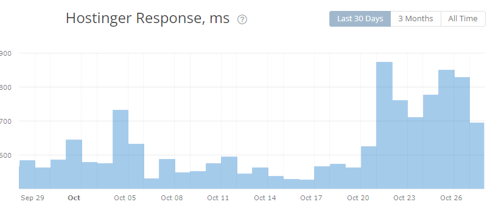

[Hostinger](https://kerrynotes.com/go/hostinger)是业界里一个比较知名的便宜主机了。这家公司成立于2004年，当时它的愿景是创建一个无广告无限制的PHP、MySQL、Cpanel的免费主机。他们当时推出了000webhost.com和Hosting24.com。近几年来他们的托管服务一直在快速增长，曾是2020年增长最快的网络托管主机公司。该公司在其服务器上运行超过100万个网站。

Hostinger的性价比挺高的，我这个站是在hostinger上的，20年买的主机，当时买了4年，一共才￥609，这让之前还在用Bluehost的我着实惊讶了一番。虽然说便宜没好货，但好在Hostinger在实惠的价格和优质服务之间取得了还不错的平衡，这使之成为新手建站的首选。

入门级托管套餐的起价仅为每月 ￥23.99（订阅期为 12 个月），如果买4年，只要[￥11.99一个月](https://www.hostg.xyz/aff_c?offer_id=6&aff_id=32194&url_id=39)。大多数人和企业都可以轻松负担得起。此外，中档套餐的新账户可以在第一年获得一个免费域名。现在黑色星期五促销，中档套餐只要[$2.49美元一个月](https://www.hostg.xyz/aff_c?offer_id=6&aff_id=32194&url_id=2294)，4年一共只要860元人民币。为了使这种托管具有更高的价值，客户可以访问 LiteSpeed 以加快他们的托管速度，而 CloudFlare 则提高了安全性。

除此之外，Hostinger还提供了中文的网站和后台，也有中文客服，还支持支付宝支付。但是他们不提供实时聊天（虽然说有，但其实不可选，只能提交工单或者邮件）

除了标准托管功能外，Hostinger 还提供多种优惠，包括：

- 从其他主机免费迁移站点

- 自定义“hPanel”控制面板

- 自动安装超过 100 个应用程序

- 我的世界服务器

- 开发者服务器

- 独立的电子邮件托管

- 免费的SSL证书

- 30 天无条件退款保证

- 分布式拒绝服务攻击 (DDoS) 保护

\[affi id=3\]

## **是什么让 Hostinger 脱颖而出？**

- Hostinger 不仅仅是标准的网站托管

- Hostinger 使用 LiteSpeed

- 由 CloudFlare 增强保护

虽然那里有成千上万的托管公司，但\[affi id=2\]在几个重要方面确实脱颖而出。首先，它提供了一些利基服务，例如 Minecraft 服务器和独立的电子邮件托管。接下来，这家公司使用 LiteSpeed 技术，可以帮助提高您网站的速度。该公司还利用 CloudFlare 进行 DDoS 保护和优化您网站的加载时间。详细了解为什么我认为 Hostinger 作为最好的托管公司之一真正闪耀。

### **Hostinger 不仅仅是标准的网站托管**

我对Hostinger印象深刻的事是，他们似乎明白网络托管不仅仅意味着网站服务器。除了正常的托管之外，Hostinger 还提供许多人绝对会喜欢的一些服务。比如：

**我的世界服务器**

多年来，Minecraft 一直是世界上最受欢迎的游戏之一。使用 Hostinger，您可以设置自己的私人游戏服务器，以便您来自世界各地的所有朋友都可以一起玩。这在 YouTuber、Twitch Streamers 和其他专业游戏玩家中非常受欢迎。

**独立的电子邮件托管**

虽然许多托管公司提供电子邮件选项，但 Hostinger 将其作为独立服务提供。如果您想要自定义企业电子邮件地址，您可以自行购买此服务，无需网站托管。

**开发服务器**

如果您是任何类型的开发人员，[Hostinger](https://kerrynotes.com/go/hostinger) 提供了著名的开发服务器，可以更轻松地与客户、团队成员和其他人组织和协调您的各种产品。

### **Hostinger 使用 LiteSpeed**

Hostinger为其所有托管平台使用 LiteSpeed 网络服务器软件。LiteSpeed 是一项出色的技术，可提供更快的响应时间并提高整体性能。虽然不像 Apache（一种更流行的托管技术）那么受欢迎，但 Hostinger 通常胜过它。此外，LiteSpeed 与 Apache 兼容，因此如果您的网站说它需要 Apache，它通常会在这些服务器上运行得更好。

其实任何人都可以安装LiteSpeed插件，这个是开源而且永久免费的，Hostinger会在你安装WordPress的时候自动给你安装上。

LiteSpeed 是任何托管环境的可靠补充。截至今天，LiteSpeed 仅在大约 10% 的网站上使用，这意味着通过选择使用此系统进行托管，您可能具有竞争优势。

<figure>

<figcaption>

资料来源：Hostinger.com

</figcaption>

</figure>

### **由 CloudFlare 提供保护和支持**

CloudFlare 是一种流行且功能强大的内容交付网络(CDN)，还提供高级 DDoS 缓解。DDoS 是一种相对简单但通常非常有效的网络攻击类型，可以针对您的网站。使用 CloudFlare 不仅可以使用标准 CDN 技术加快您网站的加载时间，还可以为您提供良好的 DDoS 攻击安全层。请注意，入门级托管包没有获得 CloudFlare CDN（尽管它们仍然受益于 CloudFlare 安全保护）。

## **Hostinger**的优点和缺点是什么？

我喜欢 Hostinger 的原因有很多，包括其可靠的托管环境、优质的 CDN 和久经考验的声誉。当然最主要还是性价比。虽然这家公司没有大问题，但有一些缺点需要注意，以防它们以任何方式影响你。在注册 Hostinger 帐户之前，请务必考虑利弊：

### 优点

1. **非常受欢迎：** Hostinger 在其服务器上运行着超过一百万个站点。

3. **hPanel** – Hostinger 使用的自定义控制面板非常易于使用，界面比起Cpanel来说要友好的多。

5. **LiteSpeed：** Hostinger 使用我非常喜欢的 LiteSpeed。这可以为您在大多数类型的网站上带来显着的性能改进。

7. **价格实惠：**无论您是获得入门级选项还是更高级的选项，Hostinger 的价格总是优惠的。但是请注意，您需要至少注册一年才能获得最优惠的价格。

9. **30 天退款保证：**所有新客户都有 30 天“无条件”退款保证。

11. **99.9% 正常运行时间保证：** Hostinger 的托管环境非常稳定，并且有 99.9% 正常运行时间保证。两年多来我自己的网站只遇上了一次停机维护。

13. **CloudFlare 保护：**所有网络托管都将获得受 CloudFlare 保护。

15. **免费域名：**新客户将获得第一年的免费域名（有 12 个月的订阅）。

17. **免费 SSL 证书：**使用 Hostinger 托管的所有网站都可以访问 Let's Encrypt（也有ZeroSSL） 提供的免费 SSL 证书。

### 缺点

1. **没有专用服务器**：Hostinger 不提供一些大公司可能需要的专用服务器。如果您的网站发展到需要专用服务器的程度，您要么必须迁移到另一家公司，要么考虑使用 Hostinger 的高端云托管选项之一。

3. **基本套餐中缺少 CloudFlare CDN**：如果您选择两个最低端托管包之一，您将无法获得 CloudFlare CDN 服务。

## **谁应该选择Hostinger？**

- **新人站长：**实惠的价格，还不错的稳定质量，成为新手可选起步的主机之一。

- **小型企业：** Hostinger 是小型企业的理想选择，因为它在不牺牲质量的情况下负担得起。

- **Minecraft 游戏玩家：**如果您是 YouTuber、Twitch Streamer，或者您只是喜欢玩 Minecraft，Hostinger 是一家提供私人服务器的优秀公司。

- **中型企业：** Hostinger 的 VPS 和云托管选项功能强大、可靠且价格低廉，是中型企业的绝佳选择。

- **开发人员：**软件和网站开发人员会喜欢 Hostinger 的代理托管，它内置了用于开发和协作的工具。

## Hostinger 托管计划和定价

### **Hostinger 共享主机包**

<table><tbody><tr><td></td><td><strong><a href="https://www.hostg.xyz/aff_c?offer_id=6&amp;aff_id=32194&amp;url_id=1653&amp;source=kerrynotes" data-type="URL" data-id="https://www.hostg.xyz/aff_c?offer_id=6&amp;aff_id=32194&amp;url_id=1653&amp;source=kerrynotes">单人共享</a></strong></td><td><strong><a href="https://www.hostg.xyz/aff_c?offer_id=6&amp;aff_id=32194&amp;url_id=1653&amp;source=kerrynotes" data-type="URL" data-id="https://www.hostg.xyz/aff_c?offer_id=6&amp;aff_id=32194&amp;url_id=1653&amp;source=kerrynotes">高级共享</a></strong></td><td><strong><a href="https://www.hostg.xyz/aff_c?offer_id=6&amp;aff_id=32194&amp;url_id=1653&amp;source=kerrynotes" data-type="URL" data-id="https://www.hostg.xyz/aff_c?offer_id=6&amp;aff_id=32194&amp;url_id=1653&amp;source=kerrynotes">商务共享</a></strong></td></tr><tr><td><strong>价格：</strong></td><td>$1.99 – 48/月</td><td>$2.99 – 48/月</td><td>$4.99 – 48/月</td></tr><tr><td><strong>网站：</strong></td><td>1</td><td>100</td><td>100</td></tr><tr><td><strong>磁盘空间：</strong></td><td>50 GB 固态硬盘</td><td>100 GB 固态硬盘</td><td>200 GB 固态硬盘</td></tr><tr><td><strong>带宽：</strong></td><td>100 GB</td><td>无限制</td><td>无限制</td></tr><tr><td><strong>附加功能：</strong></td><td>免费 SSL CloudFlare</td><td>免费 SSL CloudFlare SSH 访问</td><td>免费域名 CloudFlare SSH 访问 CloudFlare CDN WordPress staging工具</td></tr></tbody></table>

**谁应该使用共享主机？**共享主机是入门级主机类型，是大多数基本网站的可靠选择。使用 Hostinger，它适用于小型企业、新企业家、一些电子商务网站等。

### **Hostinger WordPress 托管包选项**

<table><tbody><tr><td></td><td><strong><a href="https://www.hostg.xyz/aff_c?offer_id=6&amp;aff_id=32194&amp;url_id=1653&amp;source=kerrynotes" data-type="URL" data-id="https://www.hostg.xyz/aff_c?offer_id=6&amp;aff_id=32194&amp;url_id=1653&amp;source=kerrynotes">单个 WordPress网站</a></strong></td><td><strong><a href="https://www.hostg.xyz/aff_c?offer_id=6&amp;aff_id=32194&amp;url_id=1653&amp;source=kerrynotes" data-type="URL" data-id="https://www.hostg.xyz/aff_c?offer_id=6&amp;aff_id=32194&amp;url_id=1653&amp;source=kerrynotes">WordPress 入门</a></strong></td><td><strong><a href="https://www.hostg.xyz/aff_c?offer_id=6&amp;aff_id=32194&amp;url_id=1653&amp;source=kerrynotes" data-type="URL" data-id="https://www.hostg.xyz/aff_c?offer_id=6&amp;aff_id=32194&amp;url_id=1653&amp;source=kerrynotes">商业WordPress</a></strong></td><td><strong><a href="https://www.hostg.xyz/aff_c?offer_id=6&amp;aff_id=32194&amp;url_id=1653&amp;source=kerrynotes" data-type="URL" data-id="https://www.hostg.xyz/aff_c?offer_id=6&amp;aff_id=32194&amp;url_id=1653&amp;source=kerrynotes">WordPress专业版</a></strong></td></tr><tr><td><strong>价格：</strong></td><td>1.99 美元/月</td><td>2.49 美元/月</td><td>3.99 美元/月</td><td>11.59 美元/月</td></tr><tr><td><strong>最适合：</strong></td><td>初学者理想解决方案</td><td>小型区域企业，繁忙的个人网站</td><td>大多数小型企业、入门级电子商务网站、博主</td><td>中型企业、电子商务网站、热门博主、社交影响者</td></tr><tr><td><strong>网站：</strong></td><td>1</td><td>100</td><td>100</td><td>300</td></tr><tr><td><strong>贮存：</strong></td><td>30 GB 固态硬盘</td><td>100 GB 固态硬盘</td><td>200 GB 固态硬盘</td><td>200 GB 固态硬盘</td></tr><tr><td><strong>附加功能：</strong></td><td>免费 SSL 证书 GIT 访问 CloudFlare</td><td>免费 SSL 证书 WordPress 多站点 每周备份</td><td>免费域名 – 1 年 免费 CDN 免费 SSL 证书 每日备份</td><td>免费域名 – 1 年 免费 CDN 免费 SSL 证书 每日备份 高级系统配置</td></tr></tbody></table>

**谁应该使用 Hostinger WordPress 主机？**WordPress 托管使用相同的共享托管技术，但服务器是专门为 WordPress 配置的。如果您要运行一个基于 WordPress 的网站，这种类型的套餐将非常适合，除非您将获得大量流量并且需要 VPS 或云主机。

### **Hostinger VPS 主机包选项**

\*请注意，Hostinger 提供八个级别的 VPS 托管。我只是列出入门级、中级和顶级选项以避免混淆。

<table><tbody><tr><td></td><td><strong><a href="https://www.hostg.xyz/aff_c?offer_id=6&amp;aff_id=32194&amp;url_id=1653&amp;source=kerrynotes" data-type="URL" data-id="https://www.hostg.xyz/aff_c?offer_id=6&amp;aff_id=32194&amp;url_id=1653&amp;source=kerrynotes">VPS1</a></strong></td><td><strong><a href="https://www.hostg.xyz/aff_c?offer_id=6&amp;aff_id=32194&amp;url_id=1653&amp;source=kerrynotes" data-type="URL" data-id="https://www.hostg.xyz/aff_c?offer_id=6&amp;aff_id=32194&amp;url_id=1653&amp;source=kerrynotes">VPS4</a></strong></td><td><strong><a href="https://www.hostg.xyz/aff_c?offer_id=6&amp;aff_id=32194&amp;url_id=1653&amp;source=kerrynotes" data-type="URL" data-id="https://www.hostg.xyz/aff_c?offer_id=6&amp;aff_id=32194&amp;url_id=1653&amp;source=kerrynotes">VPS8</a></strong></td></tr><tr><td><strong>价格：</strong></td><td>2.49 美元/月</td><td>8.99 美元/月</td><td>77.99 美元/月</td></tr><tr><td><strong>核心：</strong></td><td>1</td><td>4</td><td>8</td></tr><tr><td><strong>贮存：</strong></td><td>20 GB 固态硬盘</td><td>80 GB 固态硬盘</td><td>250 GB 固态硬盘</td></tr><tr><td><strong>IP地址：</strong></td><td>1</td><td>1</td><td>1</td></tr><tr><td><strong>内存：</strong></td><td>1 GB</td><td>4GB</td><td>16 GB</td></tr><tr><td><strong>带宽：</strong></td><td>1 TB</td><td>4 TB</td><td>12 TB</td></tr></tbody></table>

**谁应该使用 Hostinger VPS 托管？**Hostinger 的 VPS 托管非常适合获得大量流量的站点，或者需要确保它们不会受到服务器上其他站点活动的影响。这包括许多类型的企业、电子商务网站、博主、流行的社交媒体影响者、企业家等等。

### **Hostinger Minecraft 服务器托管包选项**

Hostinger 为 Minecraft 服务器提供了八种不同的选项。以下三个是入门级、中级和顶级选项。

<table><tbody><tr><td><strong></strong></td><td><strong><a href="https://www.hostg.xyz/aff_c?offer_id=6&amp;aff_id=32194&amp;url_id=1653&amp;source=kerrynotes" data-type="URL" data-id="https://www.hostg.xyz/aff_c?offer_id=6&amp;aff_id=32194&amp;url_id=1653&amp;source=kerrynotes">Alex Plan</a></strong></td><td><strong><a href="https://www.hostg.xyz/aff_c?offer_id=6&amp;aff_id=32194&amp;url_id=1653&amp;source=kerrynotes" data-type="URL" data-id="https://www.hostg.xyz/aff_c?offer_id=6&amp;aff_id=32194&amp;url_id=1653&amp;source=kerrynotes">Enderman Plan</a></strong></td><td><strong><a href="https://www.hostg.xyz/aff_c?offer_id=6&amp;aff_id=32194&amp;url_id=1653&amp;source=kerrynotes" data-type="URL" data-id="https://www.hostg.xyz/aff_c?offer_id=6&amp;aff_id=32194&amp;url_id=1653&amp;source=kerrynotes">Wolf Plan</a></strong></td></tr><tr><td><strong>价格：</strong></td><td>6.95 美元/月</td><td>29.95 美元/月</td><td>77.99 美元/月</td></tr><tr><td><strong>核心：</strong></td><td>1</td><td>4</td><td>8</td></tr><tr><td><strong>内存：</strong></td><td>1 GB</td><td>4GB</td><td>16 GB</td></tr><tr><td><strong>带宽：</strong></td><td>1 TB</td><td>4 TB</td><td>12 TB</td></tr></tbody></table>

**谁应该使用 Hostinger Minecraft 服务器托管？**Minecraft 服务器托管是一个非常小众的东西。任何想要拥有自己的私人 Minecraft 服务器的人都可以考虑 Hostinger 的这个选项。

## **Hostinger 托管计划功能**

Hostinger 是一家低成本的托管服务提供商，但它确实为您提供了一些高质量的功能，足以满足大多数人的需求。Hostinger 提供不同类型的托管和许多有用的功能，以获得值得注意的整体体验。

### **免费域名**

当您在 Hostinger 购买主机时，只要你购买1年以上的计划，就可以获得一个免费域名一年。

### **Zyro Site Builder 工具**

Hostinger的所有帐户都可以访问 Zyro网站构建器。该工具可让您在几分钟内创建自定义网站，而无需任何编码或编程。各种工具、主题和其他功能将使您能够创建一个您会喜欢的漂亮网站。

<figure>

<figcaption>

资料来源：Hostinger.com

</figcaption>

</figure>

### **来自 CloudFlare 的Nameserver保护**

Hostinger 的所有域名服务器都受到 CloudFlare 的 DDoS 缓解服务的保护。虽然域名服务器由所有 Hostinger 客户共享，但这是很重要的一个问题。未受保护的域名服务器代表了一些主机托管公司的严重漏洞，这可能导致不必要的停机。这可能是 Hostinger 的一个简单功能，但我喜欢它提供的附加保护。

### **免费 SSL 证书**

Hostinger 的所有主机计划都附带 Let's Encrypt 或者 ZeroSSL的免费共享 SSL 证书，该证书将为您的网站提供显著的安全性。它还确保您的网站遵循有关安全的最佳做法，谷歌确认这对于正确的 SEO 很重要。

### **控制面板的自定义 hPanel**

如今，绝大多数网络托管公司都使用 cPanel 作为其控制面板；它是一个易于使用的界面，可让您很好地控制您的托管服务器和站点。Hostinger 没有随波逐流，而是创建了自己的名为hPanel的自定义控制面板。

hPanel 是一组友好直观的工具，可以轻松管理您的网站。如果您以前从未运行过网站，您将很快学会如何导航 hPanel。但是，如果您过去使用过 cPanel，您可能需要一点时间来适应这些变化。

**Hostinger 控制面板有什么用？**

\[affi id=2\] 控制面板是您管理与网站托管和帐户相关的所有内容的地方。这包括域名管理（托管、注册、续订或转移）、电子邮件地址/收件箱配置以及您收到的服务的付款/计费。

**易于管理您的所有服务**

无论您是运行一个基本网站还是多个网站，都可以从 hPanel 管理它们。您可以从一个方便的位置执行安装内容管理系统 (CMS)、运行备份和构建站点等操作。这还允许您使用一个方便的用户名和密码访问您的网站，大多数人都会喜欢的。

此 hPanel 也是您联系 Hostinger 客户支持团队或浏览商店以在需要时添加新功能的地方。

<figure>

<figcaption>

资料来源：Hostinger.com

</figcaption>

</figure>

### **大量的网站附加组件**

设置托管帐户后，您可以使用包含的站点附加功能对其进行自定义。这包括各种模板和主题（如果您使用 Zyro 网站构建工具）、方便的备份选项等等。

### **独立的电子邮件服务**

您可以将电子邮件托管添加到您的网络托管帐户或自行购买。此[高级电子邮件托管选项](https://www.hostg.xyz/aff_c?offer_id=6&aff_id=32194&url_id=1653&source=kerrynotes)将为您提供许多有价值的功能，以帮助您充分利用电子邮件。

设置电子邮件帐户后，您将可以访问电子邮件模板、已读回执、后续提醒等。请注意，电子邮件托管不是 Hostinger 的免费功能，因此您必须单独添加或购买。

<figure>

<figcaption>

资料来源：Hostinger.com  

</figcaption>

</figure>

### **99.9% 正常运行时间保证**

Hostinger 的所有托管包都提供99.9% 的正常运行时间保证。您的托管服务器将至少有 99.9% 的时间可以为流量提供服务，这符合行业标准。

### **CloudFlare CDN**

从商务共享主机包开始，您将获得对 CloudFlare CDN 的免费访问权限。通过将关键站点文件存放在世界各地的数据中心，这有助于加快您网站的加载时间。CloudFlare CDN 拥有 152 个独立的位置，这意味着您的站点将始终托管在物理上靠近访问者的位置。

### **LiteSpeed**

Hostinger在其所有主机计划上使用 LiteSpeed。与大多数托管公司使用的其他技术相比，这可以加快服务器上的响应时间。此外，许多网络托管包将让您免费访问 CloudFlare CDN，这可以进一步加快您网站的加载速度。

### **高级安全功能**

网络托管的安全性始终很重要，Hostinger 认真对待这一责任。除了提供免费的 SSL 证书和域名服务器保护之外，它还定期扫描所有文件以查找病毒，提供有效的备份选项，并确保站点加载项保持最新。

## **Hostinger 性能和正常运行时间**

### **正常运行时间和可靠性**

[Hostinger](https://kerrynotes.com/go/hostinger)在过去30天内的正常运行时间为99.43%，对我自己来说，两年多的使用时间，就只有在上个月说要维护停机了两个小时。

<figure>

<figcaption>

资料来源：hrank.com

</figcaption>

</figure>

### **站点响应时间**

在测试站点响应时间时，重要的是要记住速度至少取决于两个主要因素。首先，请注意网络托管公司的服务器和基础设施。第二个因素是网站本身是如何制作的。我无法确定您的网站将如何创建，因此这些测试专门针对 Hostinger，

<figure>

<figcaption>

资料来源：hrank.com

</figcaption>

</figure>

可以看到，平时Hostinger的相应速度还是非常不错的。倒是十月份最近有点高。

## **Hostinger 网站安全**

### **SSL 证书**

SSL 证书已成为当今任何知名网站的重要组成部分，因此 Hostinger 在其所有托管包中免费提供它们是一件好事。免费的 SSL 证书是来自 Let's Encrypt 的共享证书，它是该技术的领导者之一。

除了允许您的网站使用此标准加密协议外，它还有助于确保您的网站在搜索引擎中的排名尽可能高。谷歌已经确认它优先考虑使用 SSL 证书的网站，而不是那些没有证书的网站。

**SSL 证书的工作原理**

SSL 证书是安装在网站页面（登录屏幕、支付页面或在线表格）上的小型数据文件，要求用户提交姓名、信用卡信息或密码等敏感信息。

SSL 证书也可以安装在 Web 服务器上，从而启用更安全的 HTTPS 协议，从而实现安全连接。

从本质上讲，SSL 证书有一个目的：将标识符（域名、服务器名称或主机名）和组织的身份绑定在一起。这证明文件的发起者或接收者就是他们所说的那个人。

### **DDoS 缓解**

DDoS 攻击是最常见的网络攻击形式之一，每天都会发生数不胜数的事件。如果处理不当，这些类型的攻击可能会使网站长时间离线。Hostinger 的所有流量都流经 CloudFlare 的 DDoS 缓解系统，以保护您的站点免受此类攻击。

## **主机支持**

\[affi id=2\]为所有客户提供 24/7 全天候支持。您可以通过实时聊天或电子邮件联系。不幸的是，该公司不提供基于电话的支持。虽然今天大多数人都更喜欢实时聊天，但实际使用时实时聊天也不是什么时候都可以。

Hostinger除了客服支持，还有中文的帮助文档，可以为您解答大多数的问题。帮助页面还显示系统状态，以便您知道 Hostinger 何时出现问题。

<figure>

<figcaption>

资料来源：hostinger.com

</figcaption>

</figure>
