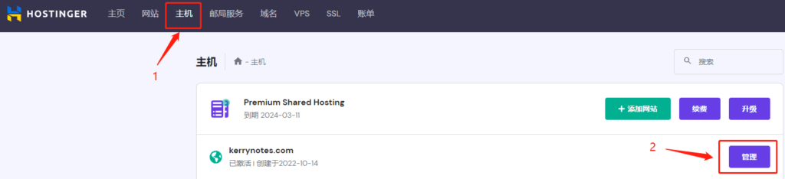
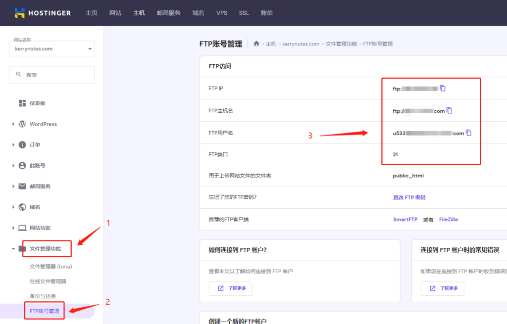
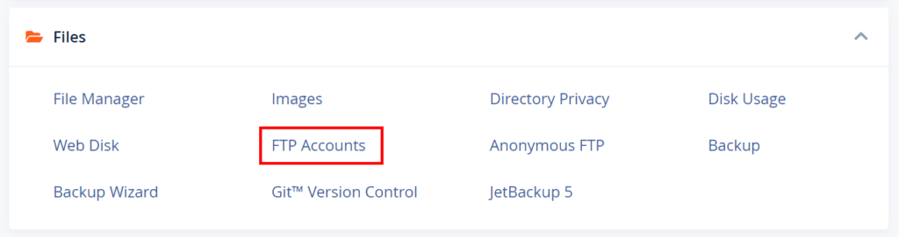
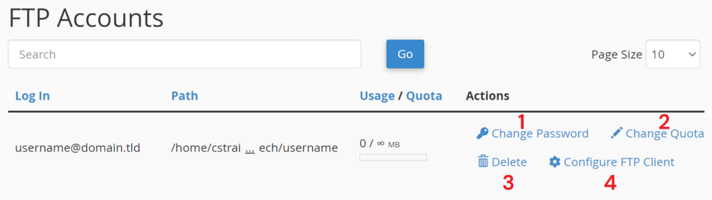
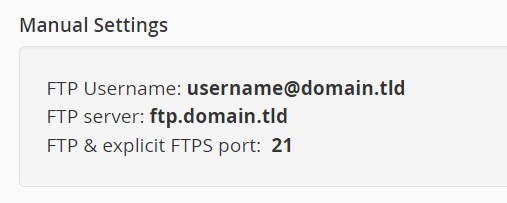
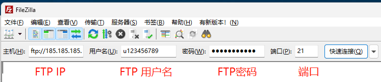
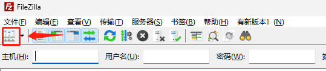
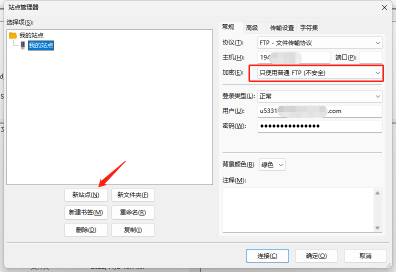
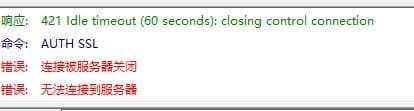

虽然说Hostinger的hPanel和文件管理器还挺好用的，但是直接使用FTP软件连接主机还是要方便很多。

## 找到你的FTP详细信息

\[affi id=2\] 有hPanel主机，但也有cPanel主机。

### 如果你是hPanel主机

1\. 进入后台，打开**主机**，点击**管理**按钮。

2\. 在左侧的导航里找到**文件管理功能，**选择其子目录FTP账号管理。随后右侧会显示你当前网站的FTP账号详细信息：FTP IP、主机名、FTP用户名还有FTP端口。

3\. 为了安全，FTP密码不会显示出来（FTP密码在开始添加网站时设置）。如果你不记得密码了，可以自行更改。

4\. 如果你选择的是可以SSH访问的主机套餐，默认情况下，SSH密码和你主域名的FTP密码相同。

### 如果你是cPanel主机

1\. Hostinger也是有cPanel的。在cPanel中找到Files分类下的FTP账户。点击之后就能看到FTP详细信息了。

<figure>

<figcaption>

来源：Hostinger

</figcaption>

</figure>

2\. 如果您之前创建了一个 FTP 帐户（可以在上面的同一页面上完成），在**FTP 帐户**部分，您将看到这些按钮：

- 更改 FTP 帐户密码

- 更改 FTP 帐户配额

- 完全删除FTP 帐户

- 检查您的 FTP 详细信息

<figure>

<figcaption>

来源：Hostinger

</figcaption>

</figure>

3\. 你的FTP详细信息应该是类似于以下内容：

<figure>

<figcaption>

来源：Hostinger

</figcaption>

</figure>

## 安装FTP客户端

Hostinger推荐使用SmartFTP（付费）和FileZilla（开源）。我这里还是用FileZilla做演示，FTP软件设置基本都是一样的。

### 下载FTP客户端

[FileZilla官网下载](https://filezilla-project.org/)

### 快速连接（可选）

打开FileZilla在快速连接位置填写你的FTP账户信息：

- 主机：FTP IP

- 用户：FTP 用户名

- 端口：21

点击快速连接，你将会连接到你的FTP服务器。如果遇到什么未知证书信息，选中“**在以后的会话中始终信任此证书**”，并点击确定即可。

### 使用站点管理器（建议）

建议使用站点管理器，可以保存之前的连接详细信息，以及可以更改加密类型或者协议（FPT或SFTP）。

在 FileZilla 中打开站点管理器：

点击新站点，然后在右边配置好你的FTP信息。点击连接，你将连上你的服务器了。

这里需要**注意**的是：如果一直提示421错误，连接不上，可以尝试把加密改成**只使用普通FTP**。

