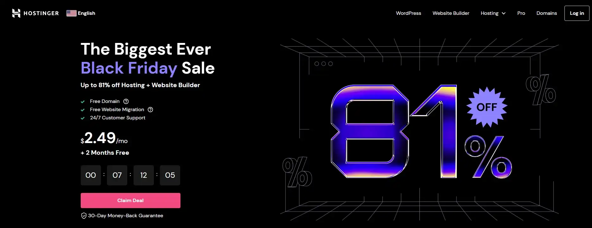
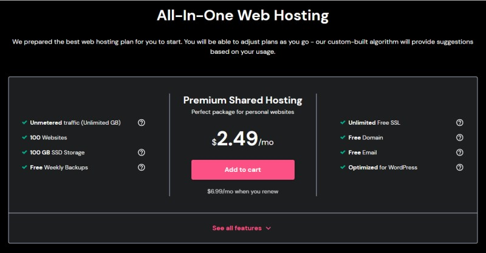
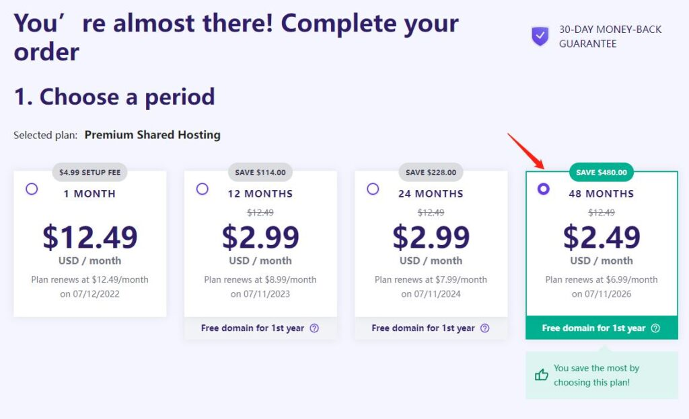
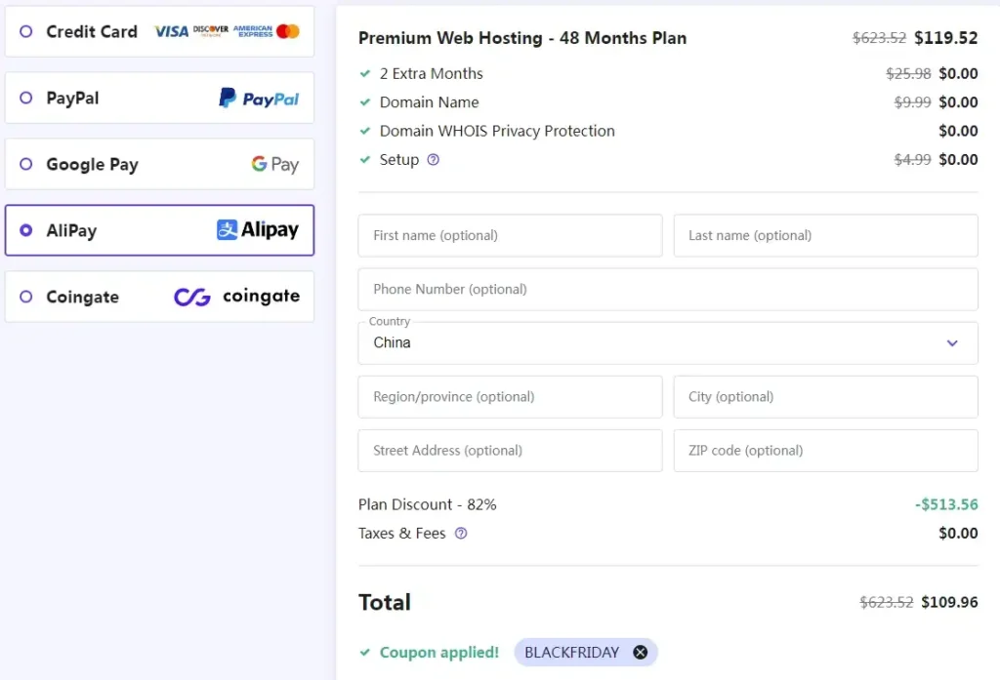
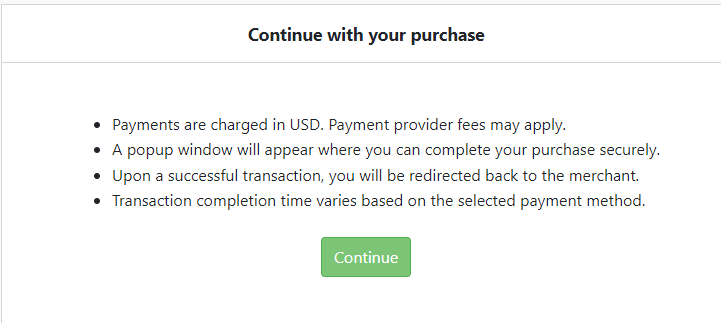
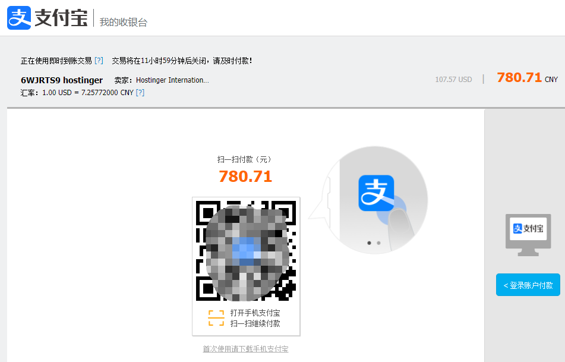
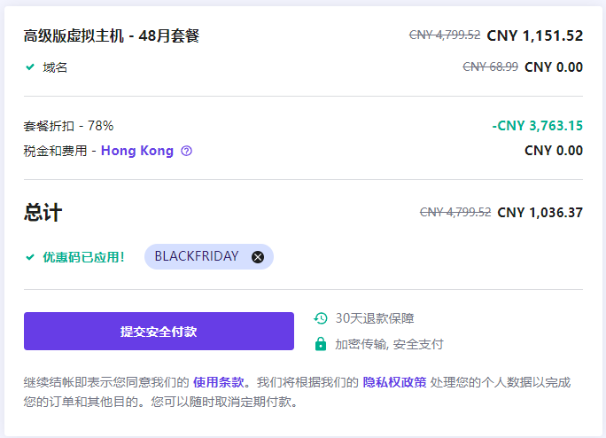

**你在找Hostinger的2023黑五优惠码？**

2023年[Hostinger](https://kerrynotes.com/go/hostinger)黑色星期五促销已经开始了，这次Hostinger为其主机托管套餐提供了81%的折扣，另外赠送2个月。虽然Hostinger这两年涨价了，但这个价格在各大主机里还是很能打的。

Hostinger 黑五优惠码

跳过所有内容直接去激活优惠。

\[wpcd\_coupon id=126\]

以下是2023年Hostinger黑色星期五促销活动介绍：

## 如何激活Hostinger的黑色星期五81%折扣的优惠？

### 前往Hostinger的美国官网

Hostinger美国官网，你会看到如下界面。点击红色按钮Claim Deal。这里你看到的是$2.49/月，80%折扣。不着急，等结算的时候输入优惠码，即可享有额外的2%。

### 选择主机套餐和订阅时长

前往他们主推的高级虚拟主机套餐，点击红色按钮Add to cart。

选择套餐订阅时长。只有选择48个月的套餐，才能享受最低价，不然是$2.99一个月。

### 创建账号

填写电子邮箱地址。注意，使用国内邮箱有可能会注册失败，比如QQ邮箱，sina邮箱。建议使用Gmail。你可以直接使用旁边的Facebook和Google账号登录。

### 输入优惠码

点击**Have a coupon code？**在输入框中填上BLACKFRIDAY优惠码，并且点击Apply按钮。价格即会更新。

### 付款

见上图。Hostinger支持信用卡、PayPal、Google Pay、支付宝还有加密货币。以支付宝举例。选择Alipay，并且点击Submit Secure Payment。会出现支付提示。

点击Continue就会前往你很熟悉的支付宝支付页面。扫码完成付款吧。

## 为什么不选择Hostinger香港站

\[affi id=2\]有香港站，但是价格比起美国站来说还是贵了一点（这个跟汇率相关）。同样是高级虚拟主机套餐，美国站是$2.49一个月，香港站是￥23.99一个月。加上这次黑五的优惠，如果你是在美国站买4年的高级主机，你需要花￥780.71。而你如果是在香港站买，哪怕加上黑五的优惠码，也还是需要￥1036.37。

综上，还是选择美国站的套餐性价比更高。

\[wpcd\_coupon id=126\]
